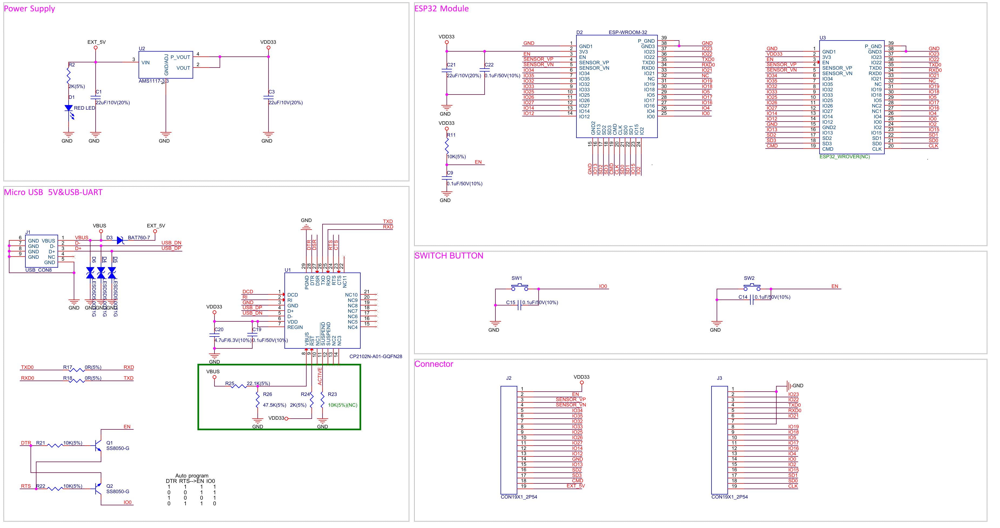

# Introducción a Arduino con ESP32

El ecosistema Arduino esta compuesto por una tarjeta con un microcontrolador y los periféricos necesarios mínimos para operar, el cual contiene un firmware para comunicarse y carga los programas realizados en C.
Esta placa trabaja en conjunto con un IDE (Entorno de Desarrollo Integrado) el cual facilita la carga y depuración de los programas realizados. 

El lenguaje que utiliza el entorno Arduino es C/C++, el cual nos ayuda a desarrollar nuestro programa y con ello desarrollar un prototipo rápido.

Todo este entorno es Open Source y Open Hardware, gracias a ello existe mucha comunidad desarrollando `mods`, `shields`, variantes de tarjetas, con el firmware que se acopla al entorno de Arduino.

En este caso usaremos la tarjeta `ESP32 Dev Kit`, la cual tiene un microcontrolador `ESP32` de la empresa `espressif`.

## Descripción general

En la siguiente imagen y la tabla se describe los componentes clases, interfaces y controles de la tarjeta ESP32-DevKitC V4.

|Componente clave|Descripción|
|---|---|
|ESP32-WROOM-32|Un modulo con un ESP32 en el núcleo. Para mas [información ver el datasheet](https://espressif.com/sites/default/files/documentation/esp32-wroom-32_datasheet_en.pdf)|
|EN|Botón de Reset|
|Boot|Download button. Holding down Boot and then pressing EN initiates Firmware Download mode for downloading firmware through the serial port.|
|Puente USB a UART|Single USB-UART bridge chip provides transfer rates of up to 3 Mbps.|
|Puerto micro USB|USB interface. Power supply for the board as well as the communication interface between a computer and the ESP32-WROOM-32 module.|
|LED de alimentación de 5V|Turns on when the USB or an external 5V power supply is connected to the board. For details see the schematics in Related Documents.|
|I/O|Most of the pins on the ESP module are broken out to the pin headers on the board. You can program ESP32 to enable multiple functions such as PWM, ADC, DAC, I2C, I2S, SPI, etc.|

## Opciones de fuente de alimentación

Hay 3 formas mutuamente exclusivas para darle alimentación a la tarjeta:

- Puerto micro USB, por default es por este medio
- 5V / GND header pins
- 3V3 / GND header pins

## Conector J2 (Izquierdo)

|No|Nombre|Tipo1|Descripción|
|---|---|---|---|
|1|3V3|P|Fuente de alimentación de 3.3V|
|2|EN|I|CHIP_PU, Reset|
|3|VP|I|GPIO36, ADC1_CH0, S_VP|
|4|VN|I|GPIO39, ADC1_CH3, S_VN|
|5|IO34|I|GPIO34, ADC1_CH6, VDET_1|
|6|IO35|I|GPIO35, ADC1_CH7, VDET_2|
|7|IO32|I/O|GPIO32, ADC1_CH4, TOUCH_CH9, XTAL_32K_P|
|8|IO33|I/O|GPIO33, ADC1_CH5, TOUCH_CH8, XTAL_32K_N|
|9|IO25|I/O|GPIO25, ADC1_CH8, DAC_1|
|10|IO26|I/O|GPIO26, ADC2_CH9, DAC_2|
|11|IO27|I/O|GPIO27, ADC2_CH7, TOUCH_CH7|
|12|IO14|I/O|GPIO14, ADC2_CH6, TOUCH_CH6, MTMS|
|13|IO12|I/O|GPIO12, ADC2_CH5, TOUCH_CH5, MTDI|
|14|GND|G|Ground (Tierra)|
|15|IO13|I/O|GPIO13, ADC2_CH4, TOUCH_CH4, MTCK|
|16|D2|I/O|GPIO9, D22|
|17|D3|I/O|GPIO10, D32|
|18|CMD|I/O|GPIO11, CMD2|
|19|5V|P|Fuente de alimentación de 5V|

## Conector J3 (Derecho)

|No|Nombre|Tipo1|Descripción|
|---|---|---|---|
|1|GND|G|Ground (Tierra)|
|2|IO23|I/O|GPIO23|
|3|IO22|I/O|GPIO22|
|4|TX|I/O|GPIO1, U0TXD|
|5|RX|I/O|GPIO3, U0RXD|
|6|IO21|I/O|GPIO21|
|7|GND|G|Ground (Tierra)|
|8|IO19|I/O|GPIO19|
|9|IO18|I/O|GPIO18|
|10|IO5|I/O|GPIO5|
|11|IO17|I/O|GPIO173|
|12|IO16|I/O|GPIO163|
|13|IO4|I/O|GPIO4, ADC2_CH0, TOUCH_CH0|
|14|IO0|G|GPIO0, ADC2_CH1, TOUCH_CH1, Boot|
|15|IO3|I/O|GPIO3|
|16|IO15|I/O|GPIO15, ADC2_CH3, TOUCH_CH3, MTDO|
|17|D1|I/O|GPIO8, D12|
|18|D0|I/O|GPIO7, D02|
|19|CLK|P|GPIO6, CLK2|

[1] (1,2): P: Fuente de alimentación; I: Input, O: Output

[2] (1,2,3,4,5,6): The pins D0, D1, D2, D3, CMD and CLK are used internally for communication between ESP32 and SPI flash memory. They are grouped on both sides near the USB connector. Avoid using these pins, as it may disrupt access to the SPI flash memory / SPI RAM.

[3] (1,2): The pins GPIO16 and GPIO17 are available for use only on the boards with the modules ESP32-WROOM and ESP32-SOLO-1. The boards with ESP32-WROVER modules have the pins reserved for internal use.

## Pinout

## Diagrama esquemático

[Ver pdf original](https://dl.espressif.com/dl/schematics/esp32_devkitc_v4-sch.pdf)

---

[Esta información fue extraída de la documentación oficial](https://docs.espressif.com/projects/esp-idf/en/latest/esp32/hw-reference/esp32/get-started-devkitc.html)