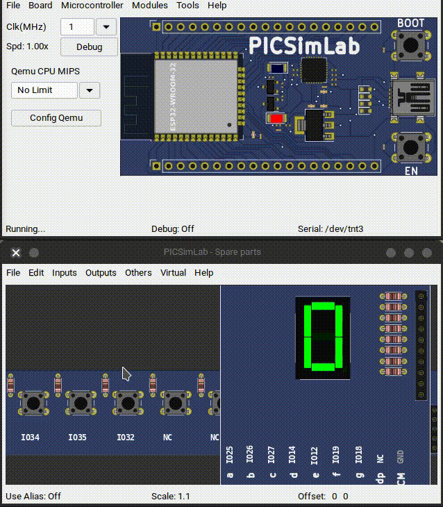

# Ejercicios con I/O Digitales

## 1. Secuencias de luces

### Funcionamiento

- Realizar una secuencia de luces, de mínimo 8 luces (LEDs) (pueden ser más),
- La secuencia es que vayan encendiendo una a una, es decir, primero 1r led, después el 2o led, así sucesivamente. Hasta que todos queden encendidos, esperas un segundo y se van apagando en el orden que se fueron encendiendo.
- Esta secuencia se irán repitiendo de manera infinita.

## 2. Secuencias de luces

### Lista de sensores y actuadores

- 8 leds
- 3 botones con su resistencia

### Funcionamiento

- Mientras se presiona el **1er botón**, debe realizar la siguiente secuencia. Ir encendiendo uno a uno los leds, una vez han encendido todos se quedan encendidos por 1 segundo, después se apagan todos  los leds durante 800mS y vuelve a comenzar la secuencia
- Mientras se presiona el **2o botón**, debe realizar la siguiente secuencia. Irán encendiendo de dos en dos, hasta que queden encendidos todos, una vez han encendido todos se quedan encendidos por 2 segundos, en ese tiempo deben parpadean 2 veces, de manera simétrica, es decir, encienden 250 segundos, se apagan 250 segundos, etc; después se apagan durante 500 mS y vuelve a comenzar la secuencia.
- Cuando presione **ambos botones al mismo tiempo**, Encienden todos los leds pares por 1 segundo, después de ese tiempo se apagan, y encienden los leds impares por 500 mS, después de eso se apagan, y se repite la secuencia.
- Mientras no presione nada, todos los leds deben parpadear a 250 mS

## 3. Alarma antirrobo

### Lista de sensores y actuadores

- 3 leds
- 2 botones con su resistencia
- 1 buzzer activo

### Funcionamiento

- Se tendrán 2 botones (sensor digital de ventana, es representativo)
- Cuando se presione cualquier botón sonará una alarma (buzzer) con 3 luces (3 leds), estos leds se quedan encendidos junto con el buzzer; el cual indica que han abierto una ventana.
- Mientras NO se active ningún botón, debe hacer un sonido cada 2 segundos junto a un led
- Si se activan ambos sensores, sonará la alarma cada 100 mS junto con 2 leds

## 4. Frase - Display de 7 Segmentos

### Funcionamiento

- Visualizar una frase personalizada, de mínimo 15 dígitos (letras con o sin números), los guiones representan un espacio y no cuenta en la frase. No hay limite en la frase.
- Ejemplo de frase, (esta frase no está permitida usar): **HOLA-CbtIS-85**

## 5. Secuencia hexadecimal - Display de 7 Segmentos

Realizar el siguiente ejercicio, como se ve en la animación



### Funcionamiento

1. Contador hexadecimal, es decir, va desde el 0 hasta la F
   - **0,1,2,3,4,5,6,7,8,9,A,B,C,D,E,F**
2. Cada que se presione un botón, debe incrementar el dígito
3. Cada que se presione otro botón, se decrementa en uno el dígito
4. Hay un tercer botón, para el reset del conteo
5. Cuando llegue al topo superior (F) o inferior (cero), no debe pasar nada

<!-- Código -->
<!--
<details markdown="1">
<summary>Código</summary>

```C
const int A = 25;
const int B = 26;
const int C = 27;
const int D = 14;
const int E = 12;
const int F = 19;
const int G = 18;
const int BTN_INC = 34;
const int BTN_DEC = 35;
const int BTN_RS = 32;

void display(int a, int b, int c, int d, int e, int f, int g);

void display(int a, int b, int c, int d, int e, int f, int g)
{
  digitalWrite(A, a);
  digitalWrite(B, b);
  digitalWrite(C, c);
  digitalWrite(D, d);
  digitalWrite(E, e);
  digitalWrite(F, f);
  digitalWrite(G, g);
}

void setup()
{
  Serial.begin(115200);
  pinMode(A, OUTPUT);
  pinMode(B, OUTPUT);
  pinMode(C, OUTPUT);
  pinMode(D, OUTPUT);
  pinMode(E, OUTPUT);
  pinMode(F, OUTPUT);
  pinMode(G, OUTPUT);
}

// the loop function runs over and over again forever
int count = 0;
void loop()
{
  if (digitalRead(BTN_INC) == 1)
  {
    delay(250);
    if (count < 15)
      count++;
  }
  else if (digitalRead(BTN_DEC) == 1)
  {
    delay(250);
    if (count > 0)
      count--;
  }
  else if (digitalRead(BTN_RS) == 1)
  {
    delay(250);
    count = 0;
  }

  if (count == 0)
    display(1, 1, 1, 1, 1, 1, 0); // 0
  if (count == 1)
    display(0, 1, 1, 0, 0, 0, 0); // 1
  if (count == 2)
    display(1, 1, 0, 1, 1, 0, 1); // 2
  if (count == 3)
    display(1, 1, 1, 1, 0, 0, 1); // 3
  if (count == 4)
    display(0, 1, 1, 0, 0, 1, 1); // 4
  if (count == 5)
    display(1, 0, 1, 1, 0, 1, 1); // 5
  if (count == 6)
    display(1, 0, 1, 1, 1, 1, 1); // 6
  if (count == 7)
    display(1, 1, 1, 0, 0, 0, 0); // 7
  if (count == 8)
    display(1, 1, 1, 1, 1, 1, 1); // 8
  if (count == 9)
    display(1, 1, 1, 0, 0, 1, 1); // 9
  if (count == 10)
    display(1, 1, 1, 0, 1, 1, 1); // A
  if (count == 11)
    display(0, 0, 1, 1, 1, 1, 1); // B
  if (count == 12)
    display(1, 0, 0, 1, 1, 1, 0); // C
  if (count == 13)
    display(0, 1, 1, 1, 1, 0, 1); // D
  if (count == 14)
    display(1, 0, 0, 1, 1, 1, 1); // E
  if (count == 15)
    display(1, 0, 0, 0, 1, 1, 1); // F

  delay(10);
}
```
</details>

 -->
