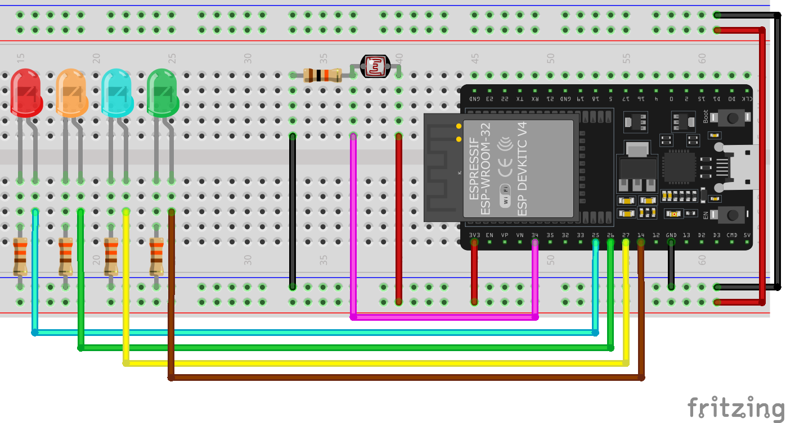
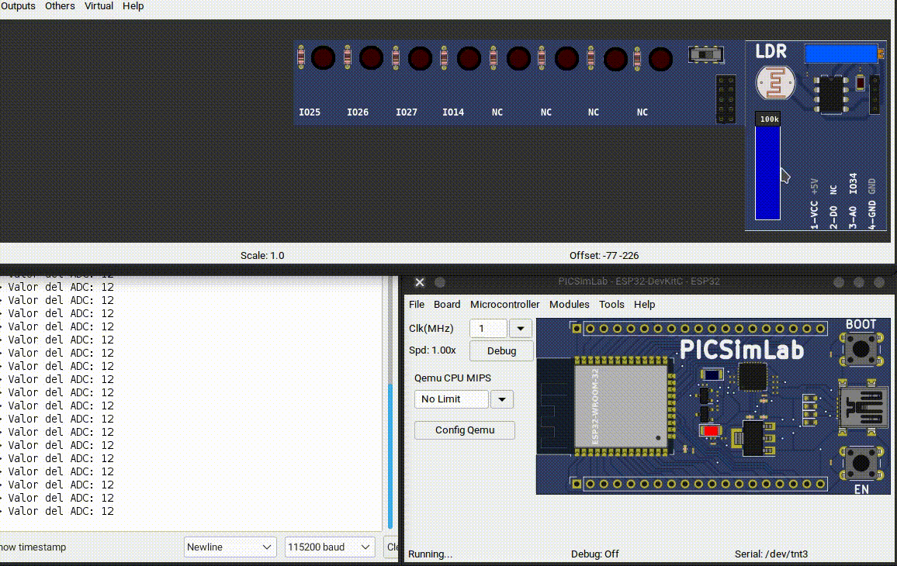

# Ejercicios con I/O Analógicas

## 1. Lámparas del parque

Realizar el siguiente ejercicio, ver la animación





### Lista de sensores y actuadores

- 8 leds
- 1 LDR con su resistencia de 10k

### Funcionamiento

- Tendremos 8 lamparas (leds) en el parque.
- Cuando exista poca luz en el sensor (esto definido por el programador), se deben encender todas las lamparas (los LEDs), de forma secuencial deben ir quedando encendidas hasta que estén todas prendidas.
- Si hay una luz intermedia, solo deben estar encendidas las lamparas pares.
- Si hay suficiente luz en el ambiente, deben estar todas apagadas todas.
- Al momento en apagarse, se irán apagando una a una, hasta que al final queden apagadas.

<!-- Bloque de código -->
<!--
<details markdown="1">
<summary>Código</summary>

```C
const byte pinADC = 34;  //pin que sera leído del ADC
const byte LED1 = 25;    //Configuro el pin en donde colocaré el LED
const byte LED2 = 26;    //Configuro el pin en donde colocaré el LED
const byte LED3 = 27;    //Configuro el pin en donde colocaré el LED
const byte LED4 = 14;    //Configuro el pin en donde colocaré el LED
#define LIMIT_INF 1500       //ESTE VALOR SE CAMBIA CON BASE AL AJUSTE DEL SENSOR
#define LIMIT_SUP 3000       //ESTE VALOR SE CAMBIA CON BASE AL AJUSTE DEL SENSOR

// the setup routine runs once when you press reset:
void setup() {
  // inicializamos el monitor serial a 115200 baudios
  Serial.begin(115200);
  pinMode(LED1, OUTPUT);  //configuro como salida el pin para el led
  pinMode(LED2, OUTPUT);  //configuro como salida el pin para el led
  pinMode(LED3, OUTPUT);  //configuro como salida el pin para el led
  pinMode(LED4, OUTPUT);  //configuro como salida el pin para el led
}

void loop() {
  int valueLDR = analogRead(pinADC);  //leemos el pin del ADC
  Serial.print("Valor del ADC: ");
  Serial.println(valueLDR);

  if (valueLDR < LIMIT_INF) {
    digitalWrite(LED1, LOW);
    delay(250);
    digitalWrite(LED2, LOW);
    delay(250);
    digitalWrite(LED3, LOW);
    delay(250);
    digitalWrite(LED4, LOW);
  } else if (valueLDR > LIMIT_INF && valueLDR < LIMIT_SUP ) {
    digitalWrite(LED1, HIGH);
    delay(250);
    digitalWrite(LED2, HIGH);
    digitalWrite(LED3, LOW);
    digitalWrite(LED4, LOW);
  } else {
    digitalWrite(LED1, HIGH);
    delay(250);
    digitalWrite(LED2, HIGH);
    delay(250);
    digitalWrite(LED3, HIGH);
    delay(250);
    digitalWrite(LED4, HIGH);
  }

  delay(10);  // para la estabilidad del valor de entrada
}
```
</details>

 -->

## 2. Control RGB

### Lista de sensores y actuadores

- 8 leds
- 5 botones con su resistencia
- 1 potenciómetro

### Funcionamiento

- Con un botón conmutas entre el control con botones o con el potenciómetro
- Con 3 botones para controlar un LED RGB, un botón para el rojo, un botón para el verde y el último para el azul, cada vez que presione un botón incremento el valor de PWM y hacer el cambio en cada color, cuando se llegue al límite, se reinicia el valor a cero.
- Con un potenciómetro y un botón, hacer el control de un LED RGB, es decir, cuando presiono el botón, conmuto entre cada color, y el potenciómetro me ajusta del 0 al 100% el color que esté seleccionado en ese momento.
