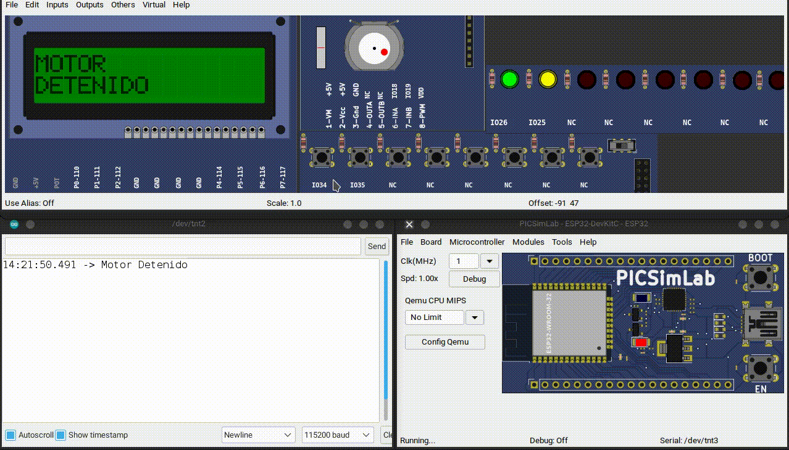

# Mini proyectos (Prácticas)

## 1. Control de Motor DC con LCD

### Lista de sensores y actuadores

- 2 leds
- Pantalla LCD
- Motor DC
- Driver para motor DC

### Funcionamiento

1. Cuando el no se este presionando ningún botón, debe estar parpadeando los 2 leds y en la pantalla indicar "MOTOR DETENIDO"
2. Cuando sea presionado un botón debe encender solamente el LED indicativo a dicha dirección, e indicar en la pantalla "MOTOR A LA DERECHA"
3. Cuando sea presionado el otro botón debe encender solamente el LED indicativo a dicha dirección, e indicar en la pantalla "MOTOR A LA IZQUIERDA"


<!--
**Código**

<details markdown="1">
<summary>Código</summary>

```C
#include <Wire.h>
#include <LiquidCrystal_I2C.h>

//Configuro los pines físicos para las entradas y salidas
const byte LED_I = 25;
const byte LED_D = 26;
const byte MOTOR_1 = 18;
const byte MOTOR_2 = 19;
const byte BTN_D = 34;
const byte BTN_I = 35;

// Set the LCD address to 0x27 for a 16 chars and 2 line display
LiquidCrystal_I2C lcd(0x27, 16, 2);

void setup() {
  // configurando los pines como entradas y salidas
  pinMode(LED_I, OUTPUT);
  pinMode(LED_D, OUTPUT);
  pinMode(MOTOR_1, OUTPUT);
  pinMode(MOTOR_2, OUTPUT);
  pinMode(BTN_I, INPUT);
  pinMode(BTN_D, INPUT);

  Serial.begin(115200);
  lcd.begin();
  // Enciende la luz de fondo pantalla
  lcd.backlight();
  //Por default comenzará a escribir en la posición x=0,y=0
  //se manda el siguiente texto a la pantalla
  lcd.print("Mecatronica 85"); //no se ponen acentos
  //Nos movemos al segundo renglón, en la primera posición
  lcd.setCursor(0, 1);
  //se manda el siguiente texto a la pantalla
  lcd.print("Motor DC");
}

int mensaje1 = 0;
int mensaje2 = 0;
int mensaje3 = 0;

void loop() {
  if (digitalRead(BTN_I) == 1) {

    if (mensaje1 == 0) {
      lcd.clear();
      lcd.setCursor(0, 0);
      lcd.print("MOTOR"); //no se ponen acentos
      lcd.setCursor(0, 1);
      lcd.print("DERECHA");
      Serial.println("Motor gira derecha");
      mensaje1++;
      mensaje2 = 0;
      mensaje3 = 0;
    }
    digitalWrite(MOTOR_1, HIGH);
    digitalWrite(MOTOR_2, LOW);
    //Leds
    digitalWrite(LED_I, HIGH);
    digitalWrite(LED_D, LOW);

  } else if (digitalRead(BTN_D) == 1) {

    if (mensaje2 == 0) {
      lcd.clear();
      lcd.setCursor(0, 0);
      lcd.print("MOTOR"); //no se ponen acentos
      lcd.setCursor(0, 1);
      lcd.print("IZQUIERDA");
      Serial.println("Motor gira Izquierdar");
      mensaje2++;
      mensaje1 = 0;
      mensaje3 = 0;
    }

    // Motor
    digitalWrite(MOTOR_1, LOW);
    digitalWrite(MOTOR_2, HIGH);
    //Leds
    digitalWrite(LED_I, LOW);
    digitalWrite(LED_D, HIGH);
  } else {

    if (mensaje3 == 0) {
      lcd.clear();
      lcd.setCursor(0, 0);
      lcd.print("MOTOR"); //no se ponen acentos
      lcd.setCursor(0, 1);
      lcd.print("DETENIDO");
      Serial.println("Motor Detenido");
      mensaje3++;
      mensaje1 = 0;
      mensaje2 = 0;
    }
    // Motor apagado
    digitalWrite(MOTOR_1, LOW);
    digitalWrite(MOTOR_2, LOW);
    //Hago un blink con los leds
    //Leds
    digitalWrite(LED_I, LOW);
    digitalWrite(LED_D, LOW);
    delay(200);
    digitalWrite(LED_I, HIGH);
    digitalWrite(LED_D, HIGH);
    delay(200);
  }
}
```

</details> -->

## 2. Cuarto automatizado

### Lista de sensores y actuadores

- Sensor de temperatura y humedad (DTH11)
- Pantalla LCD
- Motor PAP (abrir las cortinas)
- Ultrasónico (detecta cuando entras y sales del cuarto)
- Sensor de presencia (presencial el cuarto)

### Funcionamiento

- Al entrar al cuarto, detecta presencia y al pasar por la puerta (el sensor ultrasónico detecta que entraste), al estar dentro del cuarto, de manera automática se abren las cortinas (con el motor PAP, por 2 segundos, simulando que abre la cortina), mientras estés dentro del cuarto se mantienen las cortinas abiertas, al salir del cuarto, debe pasar 2 segundo y las cortinas se cierran de manera automática, obviamente si saliste el sensor ultrasónico lo detecta, mientras este no lo detecte no debe accionar nada.
- Si alguien más entra al cuarto y tú estás dentro, a causa del sensor de presencial no debe de considerar que saliste, dado que el sensor de presencial es el que conoce si sigues dentro o no. Es decir, el sensor ultrasónico detecto un paso, pero él no sabe si hacia afuera o hacia adentro.
- Cuando estés dentro del cuarto se debe ver en la pantalla la temperatura y humedad, cuando salgas del cuarto debe indicar en la pantalla, "cuarto vacío". Al entrar al cuarto, debe mostrar el mensaje de bienvenida (BIENVENIDO MI AMO) durante 2 segundos.
- cuando estés dentro del cuarto, el sensor de presencia detecta que estás dentro, las luces se encienden (2 leds)

## 3. Sistema de seguridad de cocina

### Lista de sensores y actuadores

- Sensor de flama
- 2 Sensores obstáculos (infrarrojo) y/o ultrasónico (también pueden ser combinados)
- Motor DC
- Módulo de Relay (válvula solenoide)
- Buzzer

### Funcionamiento

- Se debe realizar un sistema que detecte algún peligro en la cocina
- El sensor de obstáculos debe estar en la puerta, detectando cuando la persona entra y sale. Uno por dentro y otro por fuera, para que así sepa si la persona salió o entro.
- Si no hay nadie, y no había ninguna hornilla de la estufa funcionando, se debe desactivar el paso del gas hacia la estufa por medio de una válvula (representado con un relay - módulo de relevador), es decir, el relay se desactiva.
- Si dejaron abierta la hornilla y funcionando, es decir, están cocinando algo (sensor de flama), y la persona sale, se debe mover una válvula (representado con un servomotor) al 50% el paso del gas, y si está la persona dentro la cocina el paso del gas está al 100%.
- Cuando la persona salga y no se encendió la hornilla, se debe cerrar la válvula del gas (el servo cambia al 0%)
- Cuando se detecte que la persona salió de la cocina, y la hornilla estaba operando, pero se apaga (sensor de flama detecta que no hay flama), se debe desactivar el paso del gas, y sonar una alarma sonora, un led parpadea junto al sonido, y activa un extracto de aire (Motor DC). Cuando el cocinero vuelva, debe presionar un botón para silenciar la alarma y restablecer el paso del gas, para volver a cocinar.


## 4. Caja fuerte con llave RFID y teclado

### Sensores y actuadores

- Teclado
- Pantalla LCD
- Lector de tarjeta RFID
- Servomotor
- Buzzer

### Funcionamiento

- La caja fuerte se debe poder abrir con el código que coloque usando el teclado matricial o usando tu tarjeta o llavero RFID. También agregar el código de mi llavero RFID (cuando la hagas te paso mi código). La clave debe ser de 4 dígitos, ustedes eligen su clave. Y el botón de enter.
- Debe sonar un buzzer indicando que el acceso es correcto.
- Se debe ver en la pantalla el mensaje de bienvenida a la caja fuerte, posteriormente debe solicitar el código de acceso. Ya sea por teclado o con tarjeta (o llavero) RFID.
- No se debe ver el número que se marca, se debe ver en su lugar asteriscos "*".
- Cuando se ingrese el código 3 veces de manera incorrecta, se debe bloquear la caja, sonando el buzzer varias veces (debe dar 5 pitidos) y el mensaje de bloqueado. Así queda hasta que se resetea el micro.
- Para indicar que la puerta se abre, se activa un Servo motor, que haría la función de compuerta. Después, de 5 segundos, el servo regresa a su posición inicial (representando que esta cerrada la puerta). Vuelve a pedir el código acceso después de que el servo regreso a su posición inicial.
- Mientras está abierta la puerta debe estar encendido un led. Y apagado mientras la puerta está cerrada.

## 5. Monitor de temperatura y humedad

### Sensores y actuadores

- Sensor de temperatura DS18B20 (sonda)
- DTH11
- Pantalla LCD
- 1 botón con su resistencia

### Funcionamiento

- Se debe obtener la temperatura del sensor DTH11 y de la sonda DS18B20, obtener de cada uno 30 muestras, con esos datos la media de temperatura. Esta toma de muestras será cada segundo.
- Un led debe parpadear cada vez que se toma la muestra de la temperatura.
- En la pantalla se debe visualizar la temperatura del DTH11, DS18B20, la media de estas temperaturas y la humedad
- Con un botón debe cambiar entre mostrar la temperatura en Celsius o Fahrenheit
