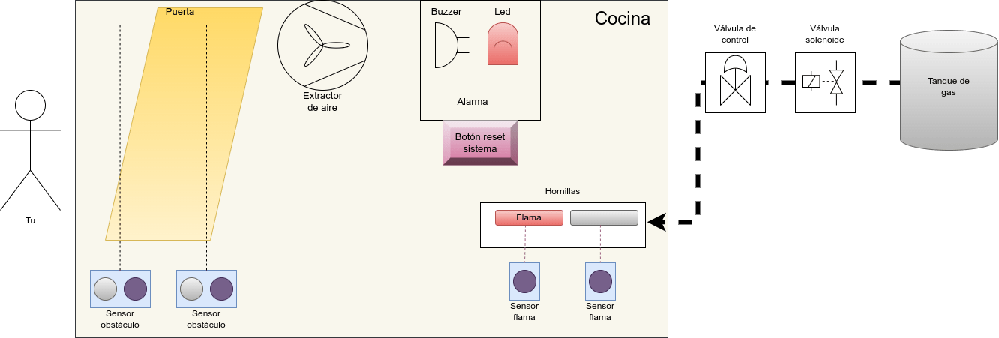

# Mini proyectos (Prácticas)

## Sistema de seguridad de cocina

**Lista de sensores y actuadores:**

- Sensor de flama
- 2 Sensores obstáculos (infrarrojo) y/o ultrasónico (también combinados)
- Motor DC
- Módulo de Relay (válvula solenoide)
- Buzzer

### Funcionamiento:

- Se debe realizar un sistema que detecte algún peligro en la cocina
- El sensor de obstáculos debe estar en la puerta, detectando cuando la persona entra y sale. Uno por dentro y otro por fuera, para que así sepa si la persona salió o entro.
- Si no hay nadie, y no había ninguna hornilla de la estufa funcionando, se debe desactivar el paso del gas hacia la estufa por medio de una válvula (representado con un relay - módulo de relevador), es decir, el relay se desactiva.
- Si dejaron abierta la hornilla y funcionando, es decir, están cocinando algo (sensor de flama), y la persona sale, se debe mover una válvula (representado con un servomotor) al 50% el paso del gas, y si está la persona dentro la cocina el paso del gas está al 100%.
- Cuando la persona salga y no se encendió la hornilla, se debe cerrar la válvula del gas (el servo cambia al 0%)
- Cuando se detecte que la persona salió de la cocina, y la hornilla estaba operando, pero se apaga (sensor de flama detecta que no hay flama), se debe desactivar el paso del gas, y sonar una alarma sonora, un led parpadea junto al sonido, y activa un extracto de aire (Motor DC). Cuando el cocinero vuelva, debe presionar un botón para silenciar la alarma y restablecer el paso del gas, para volver a cocinar.

