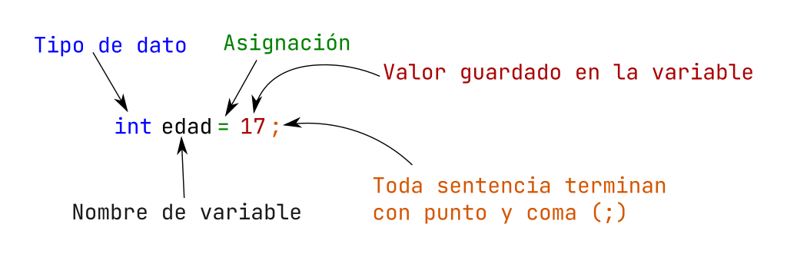

# ¿Cómo se declaran las variables ?

Cada lenguaje tiene su sintaxis de declaración de variables, en nuestro que es `lenguaje C`, es la siguiente manera:

**Sintaxis:**

```c
tipoDeDato nombreVariable = valor;
```

**Ejemplos:**

```c
int edad = 10;
float altura = 1.4;
char letra = 'a';
bool isLleno = true; // se debe importar el header <stdbool.h>
char* nombre =  "Programacion en C";
int myDec = 50/* notación decimal  */
int myOct = 062; /* notación octal (0) */
int myHex = 0x32; /* notación hexadecimal (0x) */
```
A continuación se muestra todas las partes de declaración de variable:

