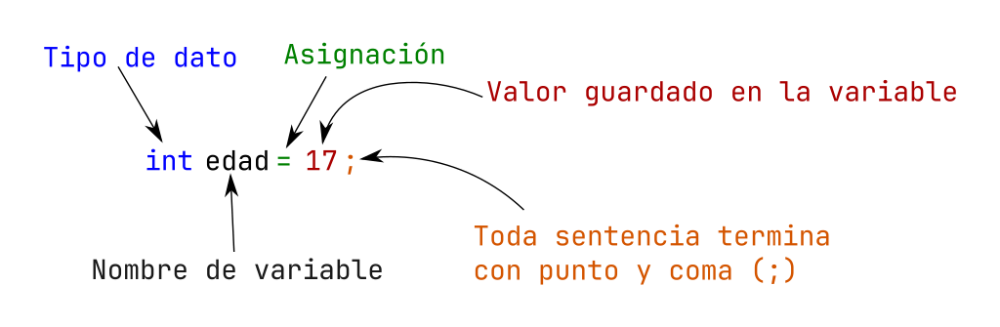

# ¿Cómo se declaran las variables ?

Cada lenguaje tiene su sintaxis de declaración de variables, en nuestro que es `lenguaje C`, es la siguiente manera:

**Sintaxis:**

```c
tipoDeDato nombreVariable = valor;
```

**Ejemplos:**

```c
int edad = 10;
float altura = 1.4;
char letra = 'a';
bool isLleno = true; // se debe importar el header <stdbool.h>
char* nombre =  "Programacion en C";
int myDec = 50/* notación decimal  */
int myOct = 062; /* notación octal (0) */
int myHex = 0x32; /* notación hexadecimal (0x) */
```
A continuación se muestra todas las partes de declaración de variable:



## Declaración de constantes

En ocasiones necesitamos declarar una variable que nunca cambie su valor, para eso existe que se vuelva constante, en el caso de `C`, se cuenta con la palabra reservada `const` al momento de declarar la variable. Esto lo que hace que una vez sea declarada, nunca mas podrá cambiar su valor.

La forma de declarar una constante es la siguiente:

```C
const tipo_de_dato NOMBRE = valor;
```

Observe que ahora la convención de Camel Case indica que una constante debe ser nombrada en mayúsculas, en caso de contar con mas de 2 palabras se van separando con guion bajo (`_`). Con ello, al momento de verla sabremos que es una constante y ese valor no se puede modificar.

```C
const float PI = 3.141592; // declaramos la constante de pi
const MAYOR_DE_EDAD = 18; // declaramos el valor para una constante para comprar cuando sea mayor de edad, este valor pues nunca cambiara
```

!!! Nota
    Existe otra manera en cierta manera mas adecuada de definir constantes que se vera mas adelante *(Spoiler: Es un preprocesador (`#define`))*