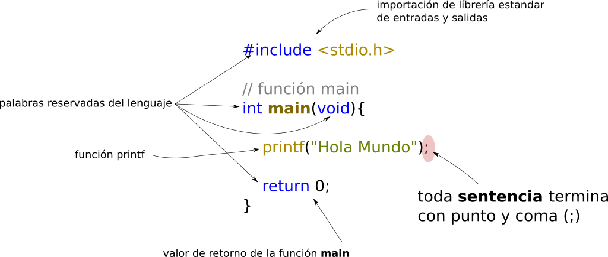

# Estructura de archivo C básica

De primera instancia si nunca haz programado es muy extraño ver muchas cosas en un archivo que prácticamente no hace nada; sin embargo, debemos asimilarlo y tomarlo como una verdad absoluta, dado que para entenderlo hay que recorrer un poco el camino, hasta que cada linea toma todo el sentido del mundo.

Con esto pasamos a ver la estructura base que llevara casi todos los archivo en C y mas los que comenzaremos a hacer

```C
// nombre del archivo debe ser main.c
#include <stdio.h>

// función main
int main(void){// inicia función main

    // aquí va todo nuestro código

    return 0; // el valor de retorno de la función main
}// termina la función main

```

**La estructura anterior por el momento SIEMPRE se escribirá así, sin preguntar nada y respetando cada símbolo en él.**

Por convención el nombre del archivo en donde va la `función main` se llamará `main.c`. La extension de los archivos en C, es `.c`; posteriormente aprenderemos que hay otras y tienen otro motivo.

!!! warning
    **Por el momento no se escribirá NADA de NADA fuera de las llaves de la función, esta estrictamente prohibido colocar algo (ya prenderemos dónde, cómo y porqué)**. Por el momento ten fé ciega 😄.

## Sintaxis

La sintaxis en un lenguaje es como saber las reglas ortográfica de cualquier idioma. Cada lenguaje de programación tiene la suya, en este caso en C tiene sus reglas:

```C
// main.c
#include <stdio.h>

// función main
int main(void){

    printf("Hola Mundo");

    return 0;
}

```



