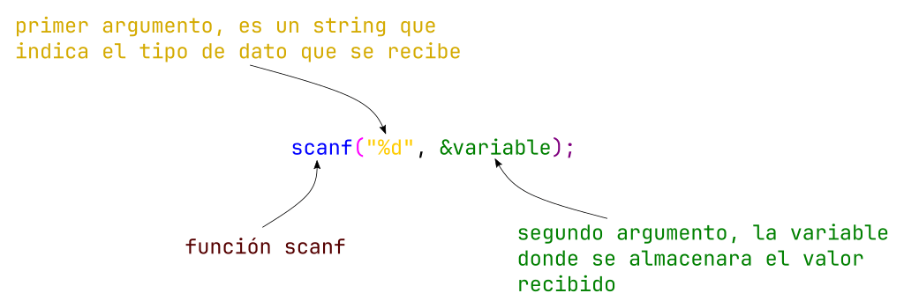

# Leyendo datos del usuario - Función scanf()

Para ir mejorando nuestros programas, que sean dinámicos y mucho mas funcionales, debemos recibir información por parte del usuario. Para ello una manera es leyendo datos de teclado que ingresa el usuario, y esto es lo que nos permite realizar la función `scanf()`. Que podríamos decir que complementa a la función `printf()`.

En la siguiente imagen se ve como cada parte de la sentencia:



En el siguiente ejemplo vemos como quedaría un código:

```c
int edad = 0;

printf("Dar el valor de la tu edad");
scanf("%d", &edad); //recibo el dato y lo almaceno en edad

int edadNueva = edad + 5; // hago una operación con este valor 

printf("Tu edad en 5 anios sera de: %d"d, edadNueva);// Recuerda que los símbolos del abecedario ingles no tiene la eñe, y no podemos poner de manera directa ese símbolo especial
```
