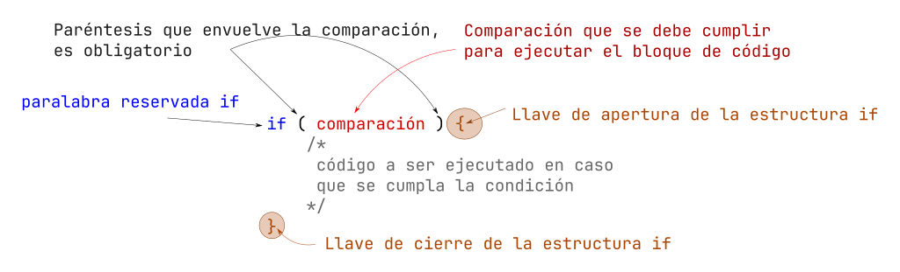

# Introducción a Decisiones (if)

Ya que sabemos como declarar variables (sentencia), imprimir por pantalla, solicitar valores al usuario; debemos hacer más dinámico nuestro programa, y la primer forma de hacerlo es tomando una decisión (una comparación).

Para esto es la condición `if` (`si`) o estructura de decision `if`

La sintaxis de la estructura `if` básica es la siguiente:



## Operadores de relación

Los operadores de relación te dan unicamente dos respuesta (*lógicas*) `si` o `no`, que son equivalentes a `true` o `false` (booleano), `uno` o `cero`, `1` o `0` (digitales), `0V` o `5V` (voltaje)respectivamente.

|Nombre|Matemáticas|Lenguaje C
|-|:-:|:-:|
|`Menor que`|`<`| `<`
|`Menor o igual que`|`≤`|`<=`
|`Mayor que`|`>`| `>`
|`Mayor o igual que`|`≥`| `>=`
|`Igual que`|`=`| `==`
|`Diferente que`|`≠`| `!=` 

### Sintaxis de comparación

La forma en la que se escriben las comparaciones es:

|Izquierda|Centro|Derecha|
|:-:|:-:|:-:|
|`valor/variable`|`operador`|`valor/variable`|
|`5`|`==`|`8`|
|`a`|`>=`|`b`|
|`10`|`<=`|`x`|
|`a`|`<=`|`2`|


### Ejemplos de comparación

Las únicas comparaciones que se pueden realizar son entre números, con respecto a las letras o carácter (único), la comparación es en su valor [ASCII](https://elcodigoascii.com.ar), en si los textos no se pueden comparar; sin embargo, aplicado a un lenguaje en concreto esto puede variar.

|Comparación | Resultado|
|:-:|:-:|
|`5 > 8`| *false*|
|`10 > 8`| *true*|
|`20 > 5`| *false*|
|`8 >= 8`| *true*|
|`6 < 8`| *true*|
|`2 <= 8`| *true*|
|`0 == 8`| *false*|
|`1 != -8`| *true*|

Las comparaciones pueden ser entre variables, obviamente dicha variable debe contener un valor previamente.

En  este caso las variables tienen este valor:

- `a = 5` 
- `b = 2` 

|Comparación | Resultado|
|:-:|:-:|
|`a > b`| *true*|
|`a >= b`| *true*|
|`a < b`| *false*|
|`a <= b`| *false*|
|`a == b`| *false*|
|`a != b`| *true*|

## Aplicando la estructura *if*

Ahora veremos código de ejemplo con la estructura `if`

```c
int edad = 18;


if (edad >= 18){ // comparamos si la variable edad es mayor o igual a 18, en caso que sea verdadero se mostrara el texto
    printf("Eres mayor de edad");
}

if (edad < 18){ // comparamos la variable
    printf("Eres menor de edad");
}

```