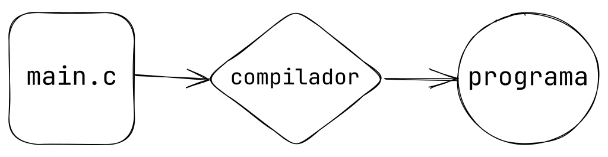

# Capítulo 1 

## Introducción al Lenguaje C

De las cosas importantes que debemos saber del lenguaje C es que es unos los principales lenguajes que existen hoy en día. 

Es la base de la mayoría de los lenguajes de alto nivel, por ejemplo JAVA, Python, están hechos con este lenguaje. Infinidad de aplicaciones y herramientas están realizadas con dicho lenguaje. El kernel de Linux esta escrito en C.

De las cosas importantes a destacar son:

- Es un lenguaje compilado
- Te permite una manipulación libre de la memoria

## Mapa del sitio

<!-- Map site insert -->

### Nota importante

En caso de no saber algoritmos, primero ir al sitio de [Algoritmos](https://www.alejandro-leyva.com/algoritmos/) para aprender y conocer, dado que aquí te toma como que usted ya tiene ese conocimiento previo.