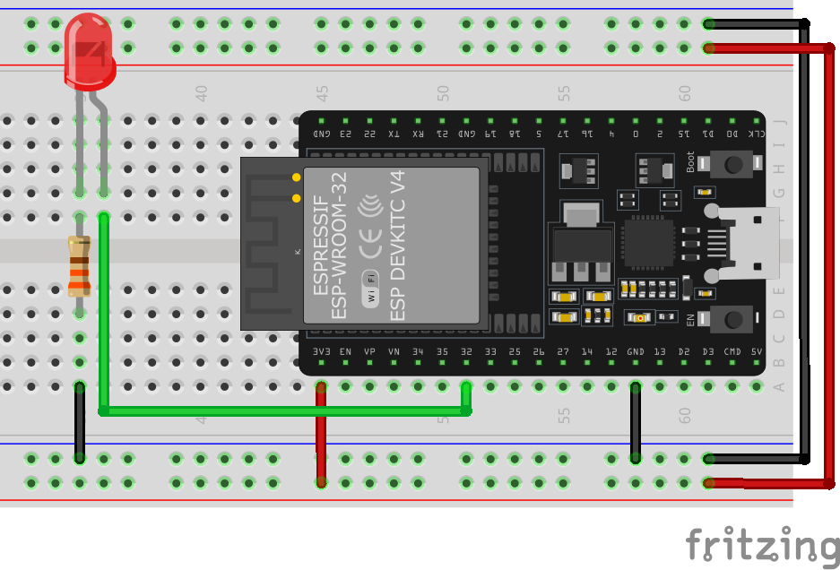
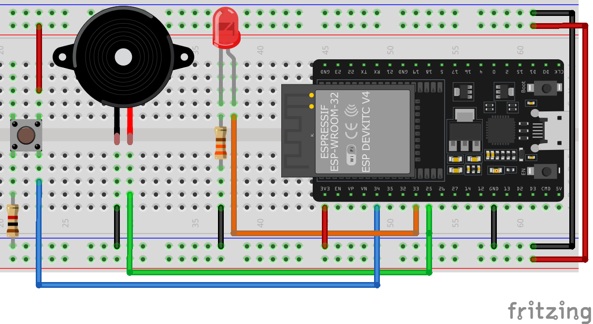
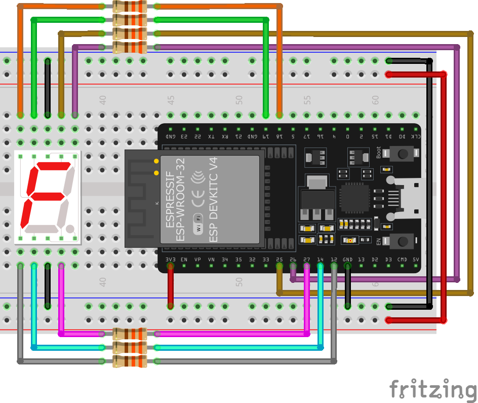
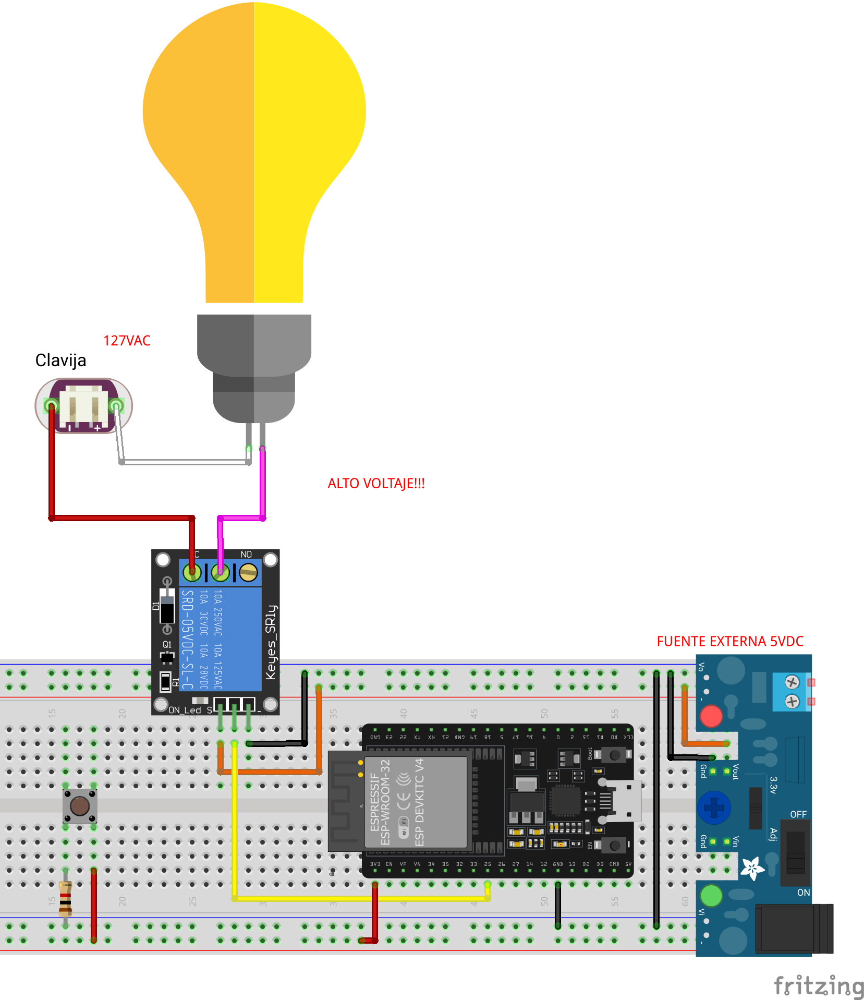
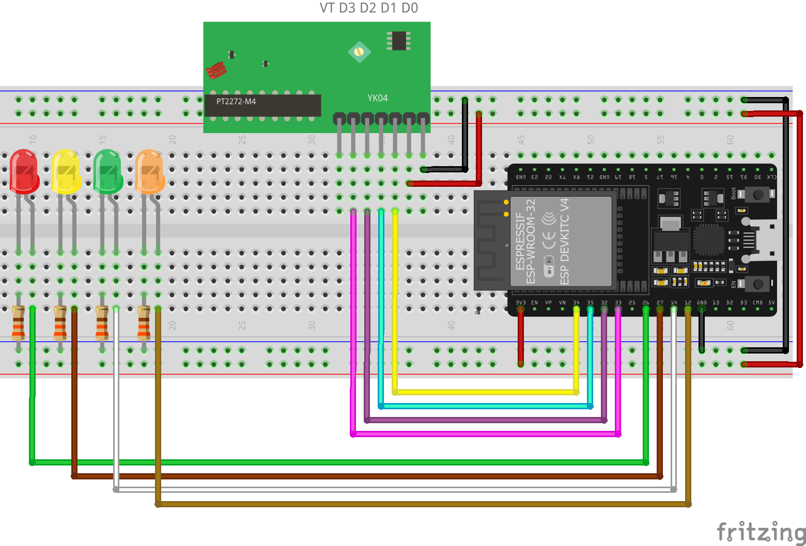

# Entradas y Salidas Digitales (I/O)

## Niveles lógicos 

Tenemos que dar las indicaciones para mandar a nivel alto las salidas del microcontrolador; es decir, mandar a un `nivel lógico 1` o `alto` o `True`, esto lo que hará será que a la salida del pin tenga un nivel de voltaje de `3.3V`, en caso de mandarlo a `0` o `bajo` o `False`, es equivalente a `0V`.

Programación|Nivel lógico|Digital|Voltaje
:-:|:-:|:-:|:-:
False|0|LOW|0V
True|1|HIGH|3.3V

## Salidas digitales

Para comenzar vamos a controlar las salidas digitales. Para esto se usa la función `digitalWrite`.

```C
// uso de la función digitalWrite
digitalWrite(NO_PIN, MODO);
```

Configuración del `MODO`:

- `OUTPUT`: Indica que el pin será `salida`
- `INPUT`: Indica que el pin será `entrada`

```C
// Aquí indicamos que el pin 32 será salida
digitalWrite(34, OUTPUT);
```

Para conocer los pines que se pueden usar o el numero que podemos pasar para el pin ver la [tabla de los pines](../index.md#Pinout)

## Entradas digitales

Para comenzar vamos a controlar las entradas digitales. Para esto se usa la función `digitalWrite`.

```C
// uso de la función digitalWrite
digitalWrite(NO_PIN, MODO)
```

Configuración del `MODO`:

- `OUTPUT`: Indica que el pin será `salida`
- `INPUT`: Indica que el pin será `entrada`

```C
// Aquí indicamos que el pin 32 será entrada
digitalWrite(32, INPUT);
```

Para conocer los pines que se pueden usar o el numero que podemos pasar para el pin ver la [tabla de los pines](../index.md#Pinout)

## Utilizando las salidas digitales

### Encender un LED

Vamos a realizar un ejemplo básico para encender un LED.

**Material**

|Cantidad|Descripción|
|---|---|
|1| Placa ESP32|
|1|  LED|
|1|  R330|

**Diagrama pictórico**



**Código**

```C
int LED = 32; // declaro una variable con el número del pin en donde tengo el led
// the setup function runs once when you press reset or power the board
void setup() {
  pinMode(LED, OUTPUT);   // configuro el pin 32 como salida
  digitalWrite(LED, LOW); // indico que el pin 32 se ponga en estado BAJO, es decir, manda un 0 a la salida
}

// the loop function runs over and over again forever
void loop() {
  digitalWrite(LED, HIGH);   // indico que el pin 32 se ponga en estado ALTO, es decir, manda un 1 a la salida, prendiendo el LED
}
```

### Encender varios LED

Vamos a realizar un ejemplo básico para encender un LED.

**Material**

|Cantidad|Descripción|
|---|---|
|1| Placa ESP32|
|3|  LED|
|3|  R330|

**Diagrama pictórico**


**Código**

```C
int LED1 = 32; // declaro una variable con el número del pin en donde tengo el led
int LED2 = 33; // declaro una variable con el número del pin en donde tengo el led
int LED3 = 25; // declaro una variable con el número del pin en donde tengo el led
// the setup function runs once when you press reset or power the board
void setup() {
  pinMode(LED1, OUTPUT);   // configuro el pin 32 como salida
  pinMode(LED2, OUTPUT);   // configuro el pin 33 como salida
  pinMode(LED3, OUTPUT);   // configuro el pin 25 como salida
  digitalWrite(LED1, LOW); // indico que el pin 32 se ponga en estado BAJO, es decir, manda un 0 a la salida
  digitalWrite(LED2, LOW); // indico que el pin 33 se ponga en estado BAJO, es decir, manda un 0 a la salida
  digitalWrite(LED3, LOW); // indico que el pin 25 se ponga en estado BAJO, es decir, manda un 0 a la salida
}

// the loop function runs over and over again forever
void loop() {
  digitalWrite(LED1, HIGH);   // indico que el pin 32 se ponga en estado ALTO, es decir, manda un 1 a la salida, prendiendo el LED
  digitalWrite(LED2, HIGH);   // indico que el pin 33 se ponga en estado ALTO, es decir, manda un 1 a la salida, prendiendo el LED
  digitalWrite(LED3, HIGH);   // indico que el pin 25 se ponga en estado ALTO, es decir, manda un 1 a la salida, prendiendo el LED
}
```

### Blink LED

Vamos a realizar un ejemplo de parpadeo de un LED, conocido como blink-blink. Con un intervalo de tiempo de 1s.

**Material**

|Cantidad|Descripción|
|---|---|
|1| Placa ESP32|
|1|  LED|
|1|  R330|

**Diagrama pictórico**


**Código**

```C

int LED = 32; // declaro una variable con el número del pin en donde tengo el led

// the setup function runs once when you press reset or power the board

void setup() {
  pinMode(LED, OUTPUT);   // configuro el pin 32 como salida
  digitalWrite(LED, LOW); // indico que el pin 32 se ponga en estado BAJO, es decir, manda un 0 a la salida
}

// the loop function runs over and over again forever
void loop() {
  digitalWrite(LED, HIGH);   // enciendo el LED 
  delay(1000);               // espero un segundo
  digitalWrite(LED, LOW);    // apago el LED
  delay(1000);              // espero un segundo
}
```

## Entradas digitales

!!! Nota
    Se estará usando por default los pines `34` y `35` para los botones dado que estos pines solo pueden ser usados como `INPUT`, y vamos a aprovechar esto para sean nuestras entradas, si tu deseas usar cualquier otro pin solo ajusta tu código.


### Control de entrada, encender LED

Vamos a usar un botón para que mientras se este presionando el botón, se encienda el LED; es decir, mientras mantenga presionado el botón el LED estará encendido

**Material**

|Cantidad|Descripción|
|---|---|
|1| Placa ESP32|
|1|  LED|
|1|  R330|
|1|  push button|
|1|  R1K|

**Diagrama pictórico**


**Código**

```C

int LED = 32; // declaro una variable con el número del pin en donde tengo el led
int BTN 34; // declaro una variable para identificar el pin en donde estará el botón

// the setup function runs once when you press reset or power the board
void setup() {
  pinMode(LED, OUTPUT);   // configuro el pin 32 como salida
  pinMode(BTN, INPUT); // configuro el pin 34 como entrada
  digitalWrite(LED, LOW); // indico que el pin 32 se ponga en estado BAJO, es decir, manda un 0 a la salida
}

// the loop function runs over and over again forever
void loop() {
  
  int status = digitalRead(BTN); //leo el estado del botón y lo guardo en la variable status
  if( status == 1){ //si el botón esta siendo presionado mando entro 
    digitalWrite(LED, HIGH);   // enciendo el LED 
    delay(250); // espero este tiempo para evitar el transitorio del botón
  }else{
    digitalWrite(LED, LOW);   // apago el LED 
  }
}
```


### LED ON/OFF

En este caso, si presiono el LED, este se enciende y se manteniente de esa manera, en caso que se vuelva a presionar, se apagará hasta que sea presionado de nuevo el LED.

**Material**

|Cantidad|Descripción|
|---|---|
|1| Placa ESP32|
|1|  LED|
|1|  R330|
|1|  push button|
|1|  R1K|

**Diagrama pictórico**


**Código**

```C

int LED = 32; // declaro una variable con el número del pin en donde tengo el led
int BTN 34; // declaro una variable para identificar el pin en donde estará el botón

// the setup function runs once when you press reset or power the board
void setup() {
  pinMode(LED, OUTPUT);   // configuro el pin 32 como salida
  pinMode(BTN, INPUT); // configuro el pin 34 como entrada
  digitalWrite(LED, LOW); // indico que el pin 32 se ponga en estado BAJO, es decir, manda un 0 a la salida
}

// the loop function runs over and over again forever
void loop() {
  
  int status = digitalRead(BTN); //leo el estado del botón y lo guardo en la variable status
  if( status == 1){ //si el botón esta siendo presionado mando entro 
    digitalWrite(LED, HIGH);   // enciendo el LED 
    delay(250); // espero este tiempo para evitar el transitorio del botón
  }else{
    digitalWrite(LED, LOW);   // apago el LED 
  }
}
```

### Control de buzzer

Vamos a realizar un control de un buzzer activo (es decir, que con alimentación emita un sonido), cuando no se presione el botón, simplemente parpadea un led a 250mS, cuando sea presionado el botón el buzzer sonara y al mismo tiempo el LED va a encender a la misma velocidad

**Material**

|Cantidad|Descripción|
|---|---|
|1| Placa ESP32|
|1|  LED|
|1|  R330|
|1|  push button|
|1|  R1K|
|1|  Buzzer activo|


**Diagrama pictórico**



**Código**

```C
const int LED = 33; // declaro una variable con el número del pin en donde tengo el led
const int BUZZER = 25; // declaro la variable con el numero del pin en donde tendré el buzzer
const int BTN = 34; // declaro una variable para identificar el pin en donde estará el botón

// the setup function runs once when you press reset or power the board
void setup() {
  pinMode(LED, OUTPUT);   // configuro el pin 33 como salida
  pinMode(BUZZER, OUTPUT);   // configuro el pin 25 como salida
  pinMode(BTN, INPUT); // configuro el pin 34 como entrada
  digitalWrite(LED, LOW); // indico que el pin 33 se ponga en estado BAJO, es decir, manda un 0 a la salida
}

// the loop function runs over and over again forever
void loop() {

  int status = digitalRead(BTN); //leo el estado del botón y lo guardo en la variable status

  if ( status == 1) { //si el botón esta siendo presionado mando entro
    digitalWrite(LED, HIGH);   // enciendo el LED
    digitalWrite(BUZZER, HIGH);   // enciendo el BUZZER
    delay(100); // espero este tiempo escuchar el sonido correcto
    digitalWrite(LED, LOW);   // enciendo el LED
    digitalWrite(BUZZER, LOW);   // enciendo el BUZZER
    delay(100); // espero este tiempo escuchar el sonido correcto
  } else {
    digitalWrite(LED, HIGH);   // enciendo el LED
    delay(250); //parpadea el LED
    digitalWrite(LED, LOW);   // enciendo el LED
    delay(250); //parpadea el LED
  }
}
```

### Display de 7 segmentos

!!! Note Nota
    Se estará usando un display de 7 segmentos de Cátodo común en todos los ejemplos, en caso de contar con uno de ánodo común, hacer los ajuste necesarios en el código

#### Contador básico con display de 7 segmentos


<details markdown="1">
<summary>Imágenes ejemplo</summary>


</details>


**Material**

|Cantidad|Descripción|
|---|---|
|1| Placa ESP32|
|1|  LED|
|7|  R330|
|1|  Display de 7 segmentos de cátodo común|


**Diagrama pictórico**



**Código**

```C
const int A = 25;
const int B = 26;
const int C = 27;
const int D = 14;
const int E = 12;
const int F = 19;
const int G = 18;

void display(int a, int b, int c, int d, int e, int f, int g);

void display(int a, int b, int c, int d, int e, int f, int g)
{
  digitalWrite(A, a);
  digitalWrite(B, b);
  digitalWrite(C, c);
  digitalWrite(D, d);
  digitalWrite(E, e);
  digitalWrite(F, f);
  digitalWrite(G, g);
}

void setup()
{
  Serial.begin(115200);
  pinMode(A, OUTPUT);
  pinMode(B, OUTPUT);
  pinMode(C, OUTPUT);
  pinMode(D, OUTPUT);
  pinMode(E, OUTPUT);
  pinMode(F, OUTPUT);
  pinMode(G, OUTPUT);
}

// the loop function runs over and over again forever

void loop()
{

  display(1, 1, 1, 1, 1, 1, 0); // 0
  delay(500);
  display(0, 1, 1, 0, 0, 0, 0); // 1
  delay(500);
  display(1, 1, 0, 1, 1, 0, 1); // 2
  delay(500);
  display(1, 1, 1, 1, 0, 0, 1); // 3
  delay(500);
  display(0, 1, 1, 0, 0, 1, 1); // 4
  delay(500);
  display(1, 0, 1, 1, 0, 1, 1); // 5
  delay(500);
  display(1, 0, 1, 1, 1, 1, 1); // 6
  delay(500);
  display(1, 1, 1, 0, 0, 0, 0); // 7
  delay(500);
  display(1, 1, 1, 1, 1, 1, 1); // 8
  delay(500);
  display(1, 1, 1, 0, 0, 1, 1); // 9
  delay(500);
  display(1, 1, 1, 0, 1, 1, 1); // A
  delay(500);
  display(0, 0, 1, 1, 1, 1, 1); // B
  delay(500);
  display(1, 0, 0, 1, 1, 1, 0); // C
  delay(500);
  display(0, 1, 1, 1, 1, 0, 1); // D
  delay(500);
  display(1, 0, 0, 1, 1, 1, 1); // E
  delay(500);
  display(1, 0, 0, 0, 1, 1, 1); // F
  delay(500);
}

```

#### Contador básico con botón, display de 7 segmentos

Ahora vamos a controlar el display haciendo el incremento de manera manual, cada que se presione el botón se hará el cambio de dígito, una vez llegue al final se reiniciara el contador.


**Material**

|Cantidad|Descripción|
|---|---|
|1| Placa ESP32|
|1|  LED|
|7|  R330|
|1|  Display de 7 segmentos de cátodo común|
|1|  Push button|
|1|  R1k|

**Diagrama pictórico**


**Código**

```C
const int A = 25;
const int B = 26;
const int C = 27;
const int D = 14;
const int E = 12;
const int F = 19;
const int G = 18;
const int BTN = 34;

void display(int a, int b, int c, int d, int e, int f, int g);

void display(int a, int b, int c, int d, int e, int f, int g)
{
  digitalWrite(A, a);
  digitalWrite(B, b);
  digitalWrite(C, c);
  digitalWrite(D, d);
  digitalWrite(E, e);
  digitalWrite(F, f);
  digitalWrite(G, g);
}

void setup()
{
  Serial.begin(115200);
  pinMode(A, OUTPUT);
  pinMode(B, OUTPUT);
  pinMode(C, OUTPUT);
  pinMode(D, OUTPUT);
  pinMode(E, OUTPUT);
  pinMode(F, OUTPUT);
  pinMode(G, OUTPUT);
}

// the loop function runs over and over again forever
int count = 0; //variable que me ayuda a conocer en que digito hay que desplegar
void loop() {

  if (digitalRead(BTN) == 1) {
    delay(250);
    if (count < 15) {
      count++;
    }
    else {
      count = 0;
    }
  }

  if (count == 0)
    display(1, 1, 1, 1, 1, 1, 0); // 0
  if (count == 1)
    display(0, 1, 1, 0, 0, 0, 0); // 1
  if (count == 2)
    display(1, 1, 0, 1, 1, 0, 1); // 2
  if (count == 3)
    display(1, 1, 1, 1, 0, 0, 1); // 3
  if (count == 4)
    display(0, 1, 1, 0, 0, 1, 1); // 4
  if (count == 5)
    display(1, 0, 1, 1, 0, 1, 1); // 5
  if (count == 6)
    display(1, 0, 1, 1, 1, 1, 1); // 6
  if (count == 7)
    display(1, 1, 1, 0, 0, 0, 0); // 7
  if (count == 8)
    display(1, 1, 1, 1, 1, 1, 1); // 8
  if (count == 9)
    display(1, 1, 1, 0, 0, 1, 1); // 9
  if (count == 10)
    display(1, 1, 1, 0, 1, 1, 1); // A
  if (count == 11)
    display(0, 0, 1, 1, 1, 1, 1); // B
  if (count == 12)
    display(1, 0, 0, 1, 1, 1, 0); // C
  if (count == 13)
    display(0, 1, 1, 1, 1, 0, 1); // D
  if (count == 14)
    display(1, 0, 0, 1, 1, 1, 1); // E
  if (count == 15)
    display(1, 0, 0, 0, 1, 1, 1); // F

  delay(10);
}
```

### Giro en dos sentidos Motor DC

Realizaremos un control básico de un control DC, haciéndolo girar en un sentido con un botón y se invertirá el sentido presionando el 2o botón. Tendrá un LED indicativo del giro.

**Material**

|Cantidad|Descripción|
|---|---|
|1| Placa ESP32|
|2|  LED|
|2|  R330|
|2|  Push button|
|2|  R1k|
|1| Driver para motor DC (MX1580, L298 o L293)|
|1| Motor DC (6V)|
|1| Fuente externa para el motor, de 1A (mínimo)|

**Diagrama pictórico**


**Código**

```C
//Configuro los pines físicos para las entradas y salidas
const byte LED_I = 25;
const byte LED_D = 26;
const byte MOTOR_1 = 18;
const byte MOTOR_2 = 19;
const byte BTN_D = 34;
const byte BTN_I = 35;

void setup() {
  // configurando los pines como entradas y salidas
  pinMode(LED_I, OUTPUT);
  pinMode(LED_D, OUTPUT);
  pinMode(MOTOR_1, OUTPUT);
  pinMode(MOTOR_2, OUTPUT);
  pinMode(BTN_I, INPUT);
  pinMode(BTN_D, INPUT);
}

void loop() {

  if (digitalRead(BTN_I) == 1) {
    delay(100);
    // Motor
    digitalWrite(MOTOR_1, HIGH);
    digitalWrite(MOTOR_2, LOW);
    //Leds
    digitalWrite(LED_I,HIGH);
    digitalWrite(LED_D,LOW);
  } else if (digitalRead(BTN_D) == 1) {
    delay(100);
    // Motor
    digitalWrite(MOTOR_1, LOW);
    digitalWrite(MOTOR_2, HIGH);
    //Leds
    digitalWrite(LED_I,LOW);
    digitalWrite(LED_D,HIGH);
  } else {
     // Motor apagado
    digitalWrite(MOTOR_1, LOW);
    digitalWrite(MOTOR_2, LOW);
    //Hago un blink con los leds
    //Leds
    digitalWrite(LED_I,LOW);
    digitalWrite(LED_D,LOW);
    delay(250);    
    digitalWrite(LED_I,HIGH);
    digitalWrite(LED_D,HIGH);
    delay(250);
  }
}
```

### Control de Motor PAP

Vamos a realizar el control de un motor Paso a Paso, en sus diferentes combinaciones de secuencias, es decir, medio paso, paso completo

**Material**

|Cantidad|Descripción|
|---|---|
|1| Placa ESP32|
|2|  LED|
|2|  R330|
|2|  Push button|
|2|  R1k|
|1| Módulo de driver para Motor PAP (ULN2003)|
|1| Motor PAP 28BYJ-48|
|1| Fuente externa para el motor, de 1A (mínimo)|

**Descripción del Motor PAP 28BYJ-48 y Driver ULN**


- Total de pasas por revolución = 2048 steps
- Ángulo del paso = 0.18º/step


**Diagrama pictórico**


**Código**

```C
#include <Stepper.h>

#define stepsPerRevolution 512  //

//se crea el objeto de la librería para ser configurada
Stepper myStepper(stepsPerRevolution, 25, 26, 27, 14);

const int BTN_I = 34;
const int BTN_D = 35;

void setup() {
  // set the speed at 60 rpm:
  myStepper.setSpeed(60);
  // initialize the serial port:
  Serial.begin(15200);
  pinMode(BTN_I, INPUT);
  pinMode(BTN_D, INPUT);
}

void loop() {

  if (digitalRead(BTN_I) == 1) {
    // step one revolution  in one direction:
    Serial.println("clockwise");
    myStepper.step(stepsPerRevolution);
    delay(10);

  }else if (digitalRead(BTN_D) == 1) {
    // step one revolution in the other direction:
    Serial.println("counterclockwise");
    myStepper.step(-stepsPerRevolution);
    delay(10);
  }

}
```

### Control de carga AC - Modulo de Relay

Realizaremos un control básico de un control DC, haciéndolo girar en un sentido con un botón y se invertirá el sentido presionando el 2o botón. Tendrá un LED indicativo del giro.

**Material**

|Cantidad|Descripción|
|---|---|
|1| Placa ESP32|
|2|  LED|
|2|  R330|
|2|  Push button|
|2|  R1k|
|1| Fuente externa para el motor, de 1A (mínimo)|
|1| Módulo de Relay|
|1| Foco (puede ser cualquier otra Carga AC ligera) con su clavija|

**Diagrama pictórico**

*Para el modulo de un Relay*



*Para el modulo doble Relay*


**Código**

```C
//creo las constantes de los pines en donde se colocaran los elementos de entrada y salida

#define MODULE_SINGLE 2  // SI ESTAS USANDO EL MODULO DE DOBLE RELAY, CAMBIA EL VALOR A 2


const byte BTN = 34;
const byte RELAY = 25;

void setup() {
  //configuro los pines como entrada y salida
  pinMode(BTN, INPUT);
  pinMode(RELAY, OUTPUT);

  if(MODULE_SINGLE == 2){
    digitalWrite(RELAY, HIGH);
  }else{
    digitalWrite(RELAY, LOW);
  }
}

void loop() {

  if (digitalRead(BTN) == 1) {
    //invierto el estado de la salida, es decir, si esta apagado se enciende
    digitalWrite(RELAY, !digitalRead(RELAY));
    delay(250);
  }
}
```

### Control RF 315 MHz

El control RF ya incluye un decodificador, es decir, este IC es el encargado de decirnos qué botón fue presionado en el control y con ello sabremos la acción a realizar.


Descripción del receptor 


Cuando se pulsa un botón el control remoto, si la comunicación es correcta levanta el pin VT para indicar que ha detectado una transmisión valida (Valid Trans).



Probando el funcionamiento del Control con receptor

**Código**

```C
///defino los pines de entrada y salida
#define D0 34
#define D1 35
#define D2 32
#define D3 33

#define LED1 26
#define LED2 27
#define LED3 14
#define LED4 12

void setup() {
  pinMode(D0, INPUT);
  pinMode(D1, INPUT);
  pinMode(D2, INPUT);
  pinMode(D3, INPUT);
  pinMode(LED1, OUTPUT);
  pinMode(LED2, OUTPUT);
  pinMode(LED3, OUTPUT);
  pinMode(LED4, OUTPUT);
  // inicializamos la pantalla para comunicación
  Serial.begin(115200);

}

void loop() {
  lcd.setCursor(0, 1); //regresamos a la posición para colocar el texto

  if (digitalRead(D0) == 1) {
    Serial.println("D0");
    digitalWrite(LED1, !digitalRead(LED1));
  }
  if (digitalRead(D1) == 1) {
    Serial.println("D1");
    digitalWrite(LED1, !digitalRead(LED2));
  }
  if (digitalRead(D2) == 1) {
    Serial.println("D2");
    digitalWrite(LED1, !digitalRead(LED3));
  }
  if (digitalRead(D3) == 1) {
    Serial.println("D3");
    digitalWrite(LED1, !digitalRead(LED4));
  }
  delay(250);
}
```

---

## Mini proyecto

### Seguidor de Luz

Es un carrito seguidor de Luz, cuando se recibe la luz en el sensor izquierdo, se activa el motor derecho, cuando recibe luz el sensor derecho se activa el motor izquierdo, si se recibe la luz en ambos se activan los 2 motores al mismo tiempo.


> [Abrir la imagen](../assets/carrito_seguidor_luz.png)

`Nota: Solo se cambia la sección de control por la placa ESP32`


**Código**

```C
//Se uso el ESP32 version Wemos
const byte sensorD = 19; //
const byte sensorI = 23;
const byte motorD_1 = 26; // 26
const byte motorD_2 = 25; // 25
const byte motorI_1 = 17; // 17
const byte motorI_2 = 16; //1 6

void setup() {
  // put your setup code here, to run once:
  Serial.begin(115200);
  Serial.println("inicio");
  pinMode(sensorD, INPUT);
  pinMode(sensorI, INPUT);
  pinMode(motorD_1, OUTPUT);
  pinMode(motorD_2, OUTPUT);
  pinMode(motorI_1, OUTPUT);
  pinMode(motorI_2, OUTPUT);
  digitalWrite(motorD_2, LOW);
  digitalWrite(motorI_2, LOW);

}

void loop() {

  if (digitalRead(sensorD) == 1 && digitalRead(sensorI) == 1) {
    Serial.println("derecho e izquierdo");
    digitalWrite(motorD_1, HIGH);
    digitalWrite(motorI_1, HIGH);
    delay(10);
  } else if (digitalRead(sensorI) == 1) {
    Serial.println("izquierdo");
    digitalWrite(motorD_1, HIGH);
    digitalWrite(motorI_1, LOW);
    delay(10);
  } else if (digitalRead(sensorD) == 1) {
    Serial.println("derecho");
    digitalWrite(motorD_1, LOW);
    digitalWrite(motorI_1, HIGH);
    delay(10);
  } else {
    Serial.println("nada");
    digitalWrite(motorD_1, LOW);
    digitalWrite(motorI_1, LOW);
    delay(10);
  }

}
```