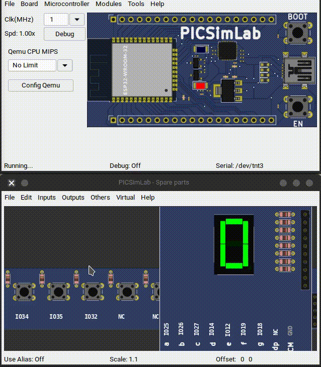
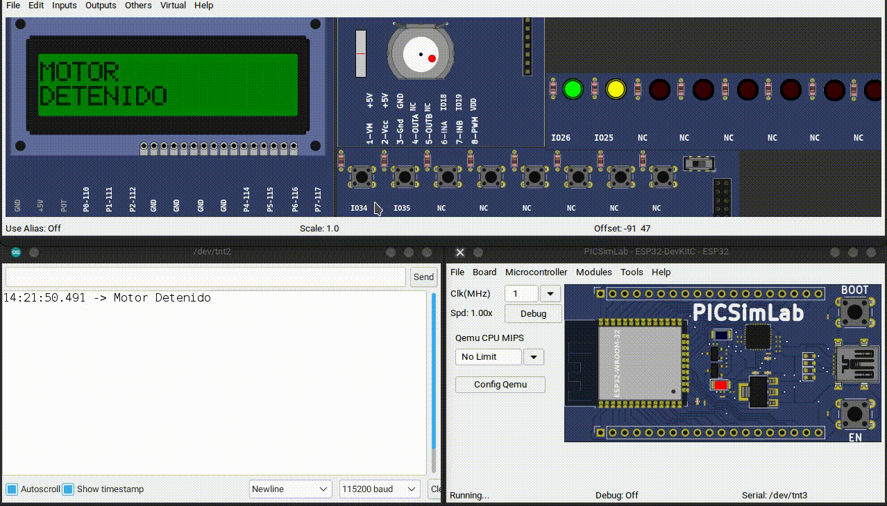

# Ejercicios con IO Digitales

## Display de 7 Segmentos

Realizar el siguiente ejercicio, como se ve en la animación



**Funcionamiento**

1. Contador hexadecimal, es decir, va desde el 0 hasta la F
   1. 0,1,2,3,4,5,6,7,8,9,A,B,C,D,E,F
2. Cada que se presione un botón, debe incrementar el dígito
3. Cada que se presione otro botón, se decrementa en uno el dígito
4. Hay un tercer botón, para el reset del conteo
5. Cuando llegue al topo superior (F) o inferior (cero), no debe pasar nada

<!-- Código -->
<!-- 
<details markdown="1">
<summary>Código</summary>

```C
const int A = 25;
const int B = 26;
const int C = 27;
const int D = 14;
const int E = 12;
const int F = 19;
const int G = 18;
const int BTN_INC = 34;
const int BTN_DEC = 35;
const int BTN_RS = 32;

void display(int a, int b, int c, int d, int e, int f, int g);

void display(int a, int b, int c, int d, int e, int f, int g)
{
  digitalWrite(A, a);
  digitalWrite(B, b);
  digitalWrite(C, c);
  digitalWrite(D, d);
  digitalWrite(E, e);
  digitalWrite(F, f);
  digitalWrite(G, g);
}

void setup()
{
  Serial.begin(115200);
  pinMode(A, OUTPUT);
  pinMode(B, OUTPUT);
  pinMode(C, OUTPUT);
  pinMode(D, OUTPUT);
  pinMode(E, OUTPUT);
  pinMode(F, OUTPUT);
  pinMode(G, OUTPUT);
}

// the loop function runs over and over again forever
int count = 0;
void loop()
{
  if (digitalRead(BTN_INC) == 1)
  {
    delay(250);
    if (count < 15)
      count++;
  }
  else if (digitalRead(BTN_DEC) == 1)
  {
    delay(250);
    if (count > 0)
      count--;
  }
  else if (digitalRead(BTN_RS) == 1)
  {
    delay(250);
    count = 0;
  }

  if (count == 0)
    display(1, 1, 1, 1, 1, 1, 0); // 0
  if (count == 1)
    display(0, 1, 1, 0, 0, 0, 0); // 1
  if (count == 2)
    display(1, 1, 0, 1, 1, 0, 1); // 2
  if (count == 3)
    display(1, 1, 1, 1, 0, 0, 1); // 3
  if (count == 4)
    display(0, 1, 1, 0, 0, 1, 1); // 4
  if (count == 5)
    display(1, 0, 1, 1, 0, 1, 1); // 5
  if (count == 6)
    display(1, 0, 1, 1, 1, 1, 1); // 6
  if (count == 7)
    display(1, 1, 1, 0, 0, 0, 0); // 7
  if (count == 8)
    display(1, 1, 1, 1, 1, 1, 1); // 8
  if (count == 9)
    display(1, 1, 1, 0, 0, 1, 1); // 9
  if (count == 10)
    display(1, 1, 1, 0, 1, 1, 1); // A
  if (count == 11)
    display(0, 0, 1, 1, 1, 1, 1); // B
  if (count == 12)
    display(1, 0, 0, 1, 1, 1, 0); // C
  if (count == 13)
    display(0, 1, 1, 1, 1, 0, 1); // D
  if (count == 14)
    display(1, 0, 0, 1, 1, 1, 1); // E
  if (count == 15)
    display(1, 0, 0, 0, 1, 1, 1); // F
  
  delay(10);
}
```
</details>

 -->

## Control de Motor DC con LCD

Realizar el siguiente ejercicio, como se ve en la animación



**Funcionamiento**

1. Cuando el no se este presionando ningún botón, debe estar parpadeando los 2 leds y en la pantalla indicar "MOTOR DETENIDO"
2. Cuando sea presionado un botón debe encender solamente el LED indicativo a dicha dirección, e indicar en la pantalla "MOTOR A LA DERECHA"
3. Cuando sea presionado el otro botón debe encender solamente el LED indicativo a dicha dirección, e indicar en la pantalla "MOTOR A LA IZQUIERDA"


<!-- 
**Código**

<details markdown="1">
<summary>Código</summary>

```C
#include <Wire.h>
#include <LiquidCrystal_I2C.h>

//Configuro los pines físicos para las entradas y salidas
const byte LED_I = 25;
const byte LED_D = 26;
const byte MOTOR_1 = 18;
const byte MOTOR_2 = 19;
const byte BTN_D = 34;
const byte BTN_I = 35;

// Set the LCD address to 0x27 for a 16 chars and 2 line display
LiquidCrystal_I2C lcd(0x27, 16, 2);

void setup() {
  // configurando los pines como entradas y salidas
  pinMode(LED_I, OUTPUT);
  pinMode(LED_D, OUTPUT);
  pinMode(MOTOR_1, OUTPUT);
  pinMode(MOTOR_2, OUTPUT);
  pinMode(BTN_I, INPUT);
  pinMode(BTN_D, INPUT);

  Serial.begin(115200);
  lcd.begin();
  // Enciende la luz de fondo pantalla
  lcd.backlight();
  //Por default comenzará a escribir en la posición x=0,y=0
  //se manda el siguiente texto a la pantalla
  lcd.print("Mecatronica 85"); //no se ponen acentos
  //Nos movemos al segundo renglón, en la primera posición
  lcd.setCursor(0, 1);
  //se manda el siguiente texto a la pantalla
  lcd.print("Motor DC");
}

int mensaje1 = 0;
int mensaje2 = 0;
int mensaje3 = 0;

void loop() {
  if (digitalRead(BTN_I) == 1) {

    if (mensaje1 == 0) {
      lcd.clear();
      lcd.setCursor(0, 0);
      lcd.print("MOTOR"); //no se ponen acentos
      lcd.setCursor(0, 1);
      lcd.print("DERECHA");
      Serial.println("Motor gira derecha");
      mensaje1++;
      mensaje2 = 0;
      mensaje3 = 0;
    }
    digitalWrite(MOTOR_1, HIGH);
    digitalWrite(MOTOR_2, LOW);
    //Leds
    digitalWrite(LED_I, HIGH);
    digitalWrite(LED_D, LOW);

  } else if (digitalRead(BTN_D) == 1) {

    if (mensaje2 == 0) {
      lcd.clear();
      lcd.setCursor(0, 0);
      lcd.print("MOTOR"); //no se ponen acentos
      lcd.setCursor(0, 1);
      lcd.print("IZQUIERDA");
      Serial.println("Motor gira Izquierdar");
      mensaje2++;
      mensaje1 = 0;
      mensaje3 = 0;
    }

    // Motor
    digitalWrite(MOTOR_1, LOW);
    digitalWrite(MOTOR_2, HIGH);
    //Leds
    digitalWrite(LED_I, LOW);
    digitalWrite(LED_D, HIGH);
  } else {

    if (mensaje3 == 0) {
      lcd.clear();
      lcd.setCursor(0, 0);
      lcd.print("MOTOR"); //no se ponen acentos
      lcd.setCursor(0, 1);
      lcd.print("DETENIDO");
      Serial.println("Motor Detenido");
      mensaje3++;
      mensaje1 = 0;
      mensaje2 = 0;
    }
    // Motor apagado
    digitalWrite(MOTOR_1, LOW);
    digitalWrite(MOTOR_2, LOW);
    //Hago un blink con los leds
    //Leds
    digitalWrite(LED_I, LOW);
    digitalWrite(LED_D, LOW);
    delay(200);
    digitalWrite(LED_I, HIGH);
    digitalWrite(LED_D, HIGH);
    delay(200);
  }
}
```

</details> -->