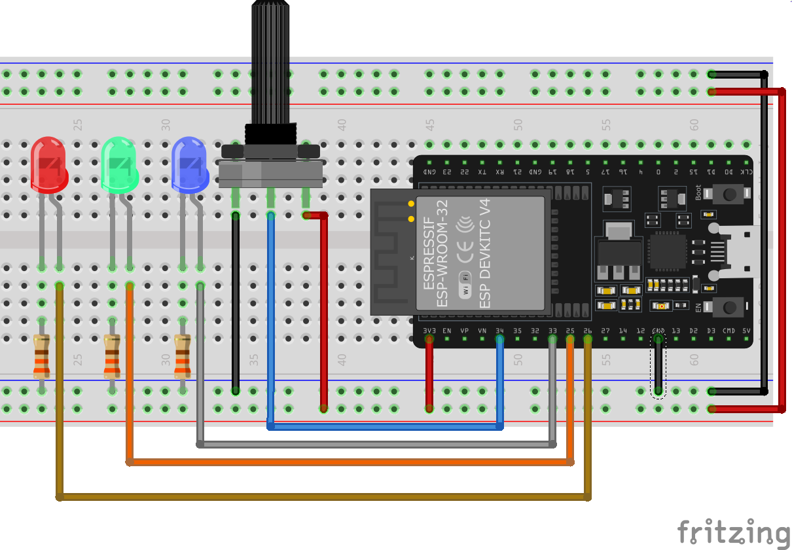

# Entradas y Salidas analógicas (ADC y PWM)

## Entradas analógicas

El ADC es un modulo interno que tiene el microcontrolador ESP32, el cual su función es convertir unas señal de voltaje a un valor equivalente en binario, este valor determinado por la resolución del convertidor.

Características del ADC

- Voltaje de entrada `0V` a `3.3V`
- Resolución de 12 bits
- Valor en decimal de `0` a `4095`
- El valor mas pequeño que podemos medir es de *0.8mV* o *800uV* (en teoría)
- Tenemos 11 canales disponibles para utilizar (*los demás no los podemos usar si usamos el framework de Arduino*)

Los pines a los que se puede conectar son los que indican `ADCx CHx`, lo cual significa Canal `X` ADC. ==*Nota: Recuerda que hay pines que no podemos utilizar.*==


!!! Note Nota
    No se necesita inicializar el pin como entrada, solo se usa la función `analogRead(pin)`. 
    ```C
    // de esta manera utilizaríamos la función y guarda el dato en una variable
    int valueADC = analogRead(noPin);
    ```

!!! Note Nota
    Se recomienda colocar un capacitor de 0.1uF en la entrada del ADC para reducir el ruido, junto con multimuestra para reducirlo lo máximo posible. [Ir a documentación oficial](https://docs.espressif.com/projects/esp-idf/en/v4.2/esp32/api-reference/peripherals/adc.html)


!!! Danger Peligro
    NUNCA se debe exceder de 3.3V a la entrada del ADC, ni voltajes negativos, esto dañaría de manera parcial o total el microcontrolador.

Hay varias características avanzadas relacionadas al ADC que no se van a tratar.

### Leyendo una entrada analógica

Vamos a realizar una lectura básica de un ADC y mandar ese valor a la monitor serial.

**Material**

|Cantidad|Descripción|
|---|---|
|1| Placa ESP32|
|1|  LED|
|1|  Pot 10k|

**Diagrama pictórico**


**Código**

```C
const byte pinADC = 34; //pin que sera leído del ADC

// the setup routine runs once when you press reset:
void setup() {
  // inicializamos el monitor serial a 115200 baudios
  Serial.begin(115200);
}

// the loop routine runs over and over again forever:
void loop() {
  //se lee el pin del ADC y se guarda en la variable valueADC
  int valueADC = analogRead(pinADC);
  Serial.println(valueADC);// se imprime el valor del ADC
  delay(10);        // para la estabilidad del valor de entrada
}
```


### Barra de LEDs con potenciómetro

Vamos a realizar una lectura del ADC e ir encendiendo los LEDs en función del valor que tengamos de entrada, es decir, entre mas valores, mas se prenderán, y entre menor sea el valor, menos encenderán.

**Material**

|Cantidad|Descripción|
|---|---|
|1| Placa ESP32|
|1|  LED|
|1|  Pot 10k|
|3|  LEDs|
|3|  R330|


**Diagrama pictórico**



**Código**

```C
const byte pinADC = 34; //pin que sera leído del ADC

// the setup routine runs once when you press reset:
void setup() {
  // inicializamos el monitor serial a 115200 baudios
  Serial.begin(115200);
}

// the loop routine runs over and over again forever:
void loop() {
  //se lee el pin del ADC y se guarda en la variable valueADC
  int valueADC = analogRead(pinADC);
  Serial.println(valueADC);// se imprime el valor del ADC
  delay(10);        // para la estabilidad del valor de entrada
}
```

### Voltímetro

### Control crepuscular (Sensor de luz)

## Salida Analógica (PWM)

Modulación de Ancho de Pulso (`Pulse width modulation` (`PWM`)) es una manera artificial de generar una salida analógica en un pin digital. Existen dos parámetros asociados al PWM que son la ==frecuencia== y el ==ciclo de trabajo== (*duty cycle*).
El ciclo de trabajo define que tan largo sera el estado del pin en alto de `un periodo`. El máximo ciclo de trabajo es cuando el pin esta todo el tiempo en alto (100%) y el mínimo todo el tiempo en bajo (0%).

En el ESP8266 todos los pines (excepto el GPIO16 o el pin 0) soportan PWM en su salida. 

!!! warning "Limitación del PWM"
    La limitación es que todos deben correr a la misma frecuencia de trabajo, la cual esta entre 1Hz y 1kHz


### Control de Intensidad de un LED

### Control de Intensidad de un LED con 2 botones

### Control de intensidad de un LED con potenciometro

### Control LED RGB

### Control de velocidad de Motor DC

### Servomotor

l servomotor que utilizaremos el SG-90, es un servomotor básico.


Este motor necesita la siguiente señal para poder generar su desplazamiento:


!!! Warning "Atención"
    Un servomotor solo se puede desplazar desde 0° hasta 180°. Por default siempre esta en 90°. Pero, comúnmente se considera 0°, dado que gira hasta 90° y -90°.

!!! Warning "Fuente adicional de 5V"
    Para hacer funcionar el servomotor se debe **implementar una fuente adicional de 5V**, ya que la propia placa NodeMCU no puede dar la suficiente corriente al motor y su sistema para funcionar adecuadamente.

!!! Note Nota
    El dato mínimo que equivale a 0 grados es 25 en el valor de PWM, y para los 180 grados o máximo es de 127. Estos valores los obtuve haciendo experimentos y pruebas con estos elementos.

    |Angulo| PWM|
    |:---:|:---:|
    | 0 grados |25 |
    | 90 grados |76 |
    | 180 grados | 127 |

  
### Control de giro de Servomotor con botones

### Control de giro de Servomotor con potenciómetro

