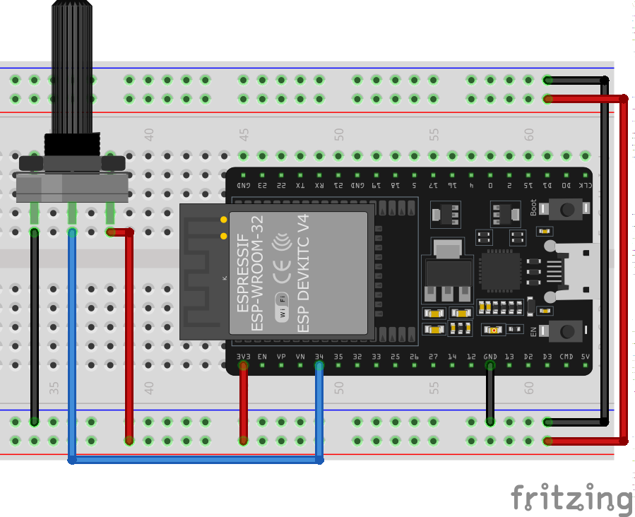
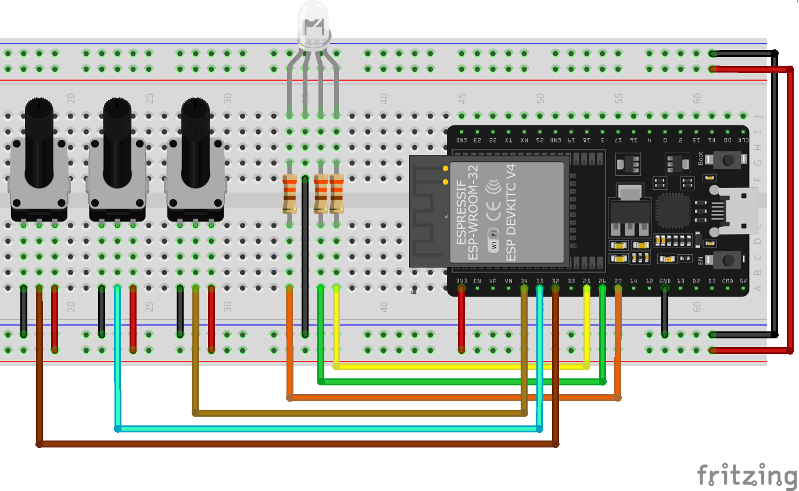

# Entradas y Salidas analógicas (ADC y PWM)

## Entradas analógicas

El ADC es un modulo interno que tiene el microcontrolador ESP32, el cual su función es convertir unas señal de voltaje a un valor equivalente en binario, este valor determinado por la resolución del convertidor.

Características del ADC

- Voltaje de entrada `0V` a `3.3V`
- Resolución de 12 bits
- Valor en decimal de `0` a `4095`
- El valor mas pequeño que podemos medir es de *0.8mV* o *800uV* (en teoría)
- Tenemos 11 canales disponibles para utilizar (*los demás no los podemos usar si usamos el framework de Arduino*)

Los pines a los que se puede conectar son los que indican `ADCx CHx`, lo cual significa Canal `X` ADC. ==*Nota: Recuerda que hay pines que no podemos utilizar.*==


!!! Note Nota
    No se necesita inicializar el pin como entrada, solo se usa la función `analogRead(pin)`. 
    ```C
    // de esta manera utilizaríamos la función y guarda el dato en una variable
    int valueADC = analogRead(noPin);
    ```

!!! Note Nota
    Se recomienda colocar un capacitor de 0.1uF en la entrada del ADC para reducir el ruido, junto con multimuestra para reducirlo lo máximo posible. [Ir a documentación oficial](https://docs.espressif.com/projects/esp-idf/en/v4.2/esp32/api-reference/peripherals/adc.html)


!!! Danger Peligro
    NUNCA se debe exceder de 3.3V a la entrada del ADC, ni voltajes negativos, esto dañaría de manera parcial o total el microcontrolador.

Hay varias características avanzadas relacionadas al ADC que no se van a tratar.

### Leyendo una entrada analógica

Vamos a realizar una lectura básica de un ADC y mandar ese valor a la monitor serial.

**Material**

|Cantidad|Descripción|
|---|---|
|1| Placa ESP32|
|1|  LED|
|1|  Pot 10k|

**Diagrama pictórico**



**Código**

```C
const byte pinADC = 34; //pin que sera leído del ADC

// the setup routine runs once when you press reset:
void setup() {
  // inicializamos el monitor serial a 115200 baudios
  Serial.begin(115200);
}

// the loop routine runs over and over again forever:
void loop() {
  //se lee el pin del ADC y se guarda en la variable valueADC
  int valueADC = analogRead(pinADC);
  Serial.println(valueADC);// se imprime el valor del ADC
  delay(10);        // para la estabilidad del valor de entrada
}
```

### Barra de LEDs con potenciómetro

Vamos a realizar una lectura del ADC e ir encendiendo los LEDs en función del valor que tengamos de entrada, es decir, entre mas valores, mas se prenderán, y entre menor sea el valor, menos encenderán.

**Material**

|Cantidad|Descripción|
|---|---|
|1| Placa ESP32|
|1|  LED|
|1|  Pot 10k|
|3|  LEDs|
|3|  R330|


**Diagrama pictórico**


**Código**

```C
const byte pinADC = 34;  //pin que sera leído del ADC
const byte LED1 = 33;    //Configuro el pin en donde colocaré el LED
const byte LED2 = 25;    //Configuro el pin en donde colocaré el LED
const byte LED3 = 26;    //Configuro el pin en donde colocaré el LED

// the setup routine runs once when you press reset:
void setup() {
  // inicializamos el monitor serial a 115200 baudios
  Serial.begin(115200);
  pinMode(LED1, OUTPUT);  //configuro como salida el pin para el led
  pinMode(LED2, OUTPUT);  //configuro como salida el pin para el led
  pinMode(LED3, OUTPUT);  //configuro como salida el pin para el led
}

// the loop routine runs over and over again forever:
void loop() {
  //se lee el pin del ADC y se guarda en la variable valueADC
  int valueADC = analogRead(pinADC);
  Serial.println(valueADC);  // se imprime el valor del ADC
  if (valueADC < 100) {      // si esta por debajo de este valor, se apagando todos los LEDs
    digitalWrite(LED1, LOW);
    digitalWrite(LED2, LOW);
    digitalWrite(LED3, LOW);
  } else if (valueADC > 100 && valueADC <= 1500) {  // si esta en este rango prenderá los leds indicados
    digitalWrite(LED1, HIGH);
    digitalWrite(LED2, LOW);
    digitalWrite(LED3, LOW);
  } else if (valueADC > 1500 && valueADC <= 3000) {  // si esta en este rango prenderá los leds indicados
    digitalWrite(LED1, HIGH);
    digitalWrite(LED2, HIGH);
    digitalWrite(LED3, LOW);
  } else {  //si es mayor a 3000, se encienden todos los leds
    digitalWrite(LED1, HIGH);
    digitalWrite(LED2, HIGH);
    digitalWrite(LED3, HIGH);
  }
  delay(10);  // para la estabilidad del valor de entrada
}
```


### Control crepuscular (Sensor de luz)

Vamos a encender el LED cuando hay poco luz, de lo contrario se debe apagar.

**Material**

|Cantidad|Descripción|
|---|---|
|1| Placa ESP32|
|1|  LED|
|1|  R330|
|1|  R10k|
|1|  LDR|

**Diagrama pictórico**


**Código**

```C
const byte pinADC = 34;  //pin que sera leído del ADC
const byte LED1 = 25;    //Configuro el pin en donde colocaré el LED
#define LIMIT 2500       //ESTE VALOR SE CAMBIA CON BASE AL AJUSTE DEL SENSOR

// the setup routine runs once when you press reset:
void setup() {
  // inicializamos el monitor serial a 115200 baudios
  Serial.begin(115200);
  pinMode(LED1, OUTPUT);  //configuro como salida el pin para el led
}

void loop() {
  int valueLDR = analogRead(pinADC);  //leemos el pin del ADC
  Serial.print("Valor del ADC: ");
  Serial.println(valueLDR);

  if (valueLDR > LIMIT) {
    digitalWrite(LED1, HIGH);
  } else {
    digitalWrite(LED1, LOW);
  }

  delay(10);  // para la estabilidad del valor de entrada
}
```

## Salida Analógica (PWM)

Modulación de Ancho de Pulso (`Pulse width modulation` (`PWM`)) es una manera artificial de generar una salida analógica en un pin digital. Existen dos parámetros asociados al PWM que son la ==frecuencia== y el ==ciclo de trabajo== (*duty cycle*).
El ciclo de trabajo define que tan largo sera el estado del pin en alto de `un periodo`. El máximo ciclo de trabajo es cuando el pin esta todo el tiempo en alto (100%) y el mínimo todo el tiempo en bajo (0%).

En el ESP8266 todos los pines (excepto el GPIO16 o el pin 0) soportan PWM en su salida. 

!!! warning "Limitación del PWM"
    La limitación es que todos deben correr a la misma frecuencia de trabajo, la cual esta entre 1Hz y 1kHz


### Configuración de PWM en ESP32

Características del PWM en el ESP32

- 16 Canales. `Canal 0 - 15` (excepto los pines GPIO36, GPIO39, GPIO34, y GPIO35)
- Resolución de 1 - 16 bits. 
- 3 Funciones para control y configuración


Las funciones para el PWM

- `ledcSetup`: Para configuración de inicio del PWM
- `ledcAttachPin`: Asigna la configuración al pin indicado
- `ledcWrite`: Escribe el valor que saldrá por el pin.

Detalles de la funciones

- `ledcSetup(canal_PWM, frecuencia, resolucion)`: Es la primera funcion que se debe llamar y solo una vez para configurar el comportamiento del PWM
  - `canal_PWM`: Es un valor del 0 al 15, donde se selecciona el canal que usaremos del uC
  - `frecuencia`: Es la frecuencia de trabajo del PWM. Vamos a manejar por default 1000 (1kHz)
  - `resolucion`: Tenemos desde 1 a 16 bits de resolución, en la mayoria de aplicaciones con 8 bits es suficiente o hasta 10 bits. Recordemos que para saber cual sera el valor minimo debemos de aplicar $3.3V/resolucion_{bits}$. Con 8 bits sería $3.3/256=0.012V$
- `ledcAttachPin(pin, canal_PWM)`:
  - `pin`: Es el numero del pin que vamos a usar como salida PWM (ver el esquema de los pines que podemos usar)
  - `canal_PWM`: El canal que colocamos en la función anterior
- `ledcWrite(canal_PWM, valorPWM)`: La función que se encarga de poner el valor en el pin indicado con un cierto ciclo de trabajo.
  - `canal_PWM`: El canal que estamos usando para el PWM
  - `valorPWM`: El valor que queremos asignar. Recordar que el valor esta en función de la resolución. Por ejemplo, si estamos usando 8 bits, los valores van desde 0 a 255.


[Ver mas detalles en la documentación oficial](https://espressif-docs.readthedocs-hosted.com/projects/arduino-esp32/en/latest/api/ledc.html)


### Control LED RGB

Haremos un simple cambio de color, incrementando el brillo de cada uno.

!!! Warning Cuidado
    **Se esta utilizando en LED RGB de cátodo común**, si usas uno de Ánodo común, haz tu ajuste en el código y las conexiones

**Diagrama pictórico**


<details markdown="1">
<summary>Animación</summary>
  
  

  

</details>

<details markdown="1">
<summary>Código</summary>

```C
#define LED_R 25  // PIN LED ROJO
#define LED_G 26  // PIN LED VERDE
#define LED_B 27  // PIN LED AZUL

#define FREQ        1000  // frecuencia de trabajo para el PWM a 1KHz
#define ledChannel0 0     //defino el canal 0, que usaremos para el color Rojo
#define ledChannel1 1     //defino el canal 1, que usaremos para el color Verde
#define ledChannel2 2     //defino el canal 2, que usaremos para el color Azul
#define resolution  8     // 8-bit de resolución (para Leds es ideal)

void setup() {
  // configuro el comportamiento del canal
  ledcSetup(ledChannel0, FREQ, resolution);
  ledcSetup(ledChannel1, FREQ, resolution);
  ledcSetup(ledChannel2, FREQ, resolution);

  //se asigna el Pin al canal configurado previamente
  ledcAttachPin(LED_R, ledChannel0);
  ledcAttachPin(LED_G, ledChannel1);
  ledcAttachPin(LED_B, ledChannel2);
}

void loop() {
  //se apagan todos los Leds
  ledcWrite(ledChannel0, 0);
  ledcWrite(ledChannel1, 0);
  ledcWrite(ledChannel2, 0);
  delay(15);

  // Incrementa el brillo del rojo
  for (int dutyCycle = 0; dutyCycle <= 255; dutyCycle++) {
    ledcWrite(ledChannel0, dutyCycle);
    delay(15);
  }
  // Incrementa el brillo del verde
  for (int dutyCycle = 0; dutyCycle <= 255; dutyCycle++) {
    ledcWrite(ledChannel1, dutyCycle);
    delay(15);
  }
  // Incrementa el brillo del azul
  for (int dutyCycle = 0; dutyCycle <= 255; dutyCycle++) {
    ledcWrite(ledChannel2, dutyCycle);
    delay(15);
  }
}
```

</details>


### Control de Intensidad de un LED botones

Haremos un simple cambio de color con botones, incrementando el brillo de cada uno cuando se presione un botón, para su respectivo color.

!!! Warning Cuidado
    **Se esta utilizando en LED RGB de cátodo común**, si usas uno de Ánodo común, haz tu ajuste en el código y las conexiones

**Diagrama pictórico**


<details markdown="1">
<summary>Animación</summary>
  
  

</details>

<details markdown="1">
<summary>Código</summary>

```C
#define LED_R 25  // PIN LED ROJO
#define LED_G 26  // PIN LED VERDE
#define LED_B 27  // PIN LED AZUL

#define BTN_R 34  // PIN LED ROJO
#define BTN_G 35  // PIN LED VERDE
#define BTN_B 32  // PIN LED AZUL

#define FREQ        1000  // frecuencia de trabajo para el PWM a 1KHz
#define ledChannel0 0     //defino el canal 0, que usaremos para el color Rojo
#define ledChannel1 1     //defino el canal 1, que usaremos para el color Verde
#define ledChannel2 2     //defino el canal 2, que usaremos para el color Azul
#define resolution  8     // 8-bit resolution

void setup() {
  pinMode(BTN_R, INPUT);
  pinMode(BTN_G, INPUT);
  pinMode(BTN_B, INPUT);
  // configuro el comportamiento del canal
  ledcSetup(ledChannel0, FREQ, resolution);
  ledcSetup(ledChannel1, FREQ, resolution);
  ledcSetup(ledChannel2, FREQ, resolution);

  //se asigna el Pin al canal configurado previamente
  ledcAttachPin(LED_R, ledChannel0);
  ledcAttachPin(LED_G, ledChannel1);
  ledcAttachPin(LED_B, ledChannel2);
  //se apagan todos los Leds
  ledcWrite(ledChannel0, 0);
  ledcWrite(ledChannel1, 0);
  ledcWrite(ledChannel2, 0);
  Serial.begin(115200);
}

unsigned char red = 0;
unsigned char blue = 0;
unsigned char green = 0;
unsigned char inc = 5;

void loop() {
  // Incrementa el brillo del rojo
  if (digitalRead(BTN_R) == 1) {
    if (red > 254) {
      red = 0;
    } else {
      red += inc;
    }
    ledcWrite(ledChannel0, red);
    Serial.print("Rojo: ");
    Serial.println(red);
    delay(200);
  }

  if (digitalRead(BTN_G) == 1) {
    if (green > 254) {
      green = 0;
    } else {
      green += inc;
    }
    ledcWrite(ledChannel1, green);
    Serial.print("Verde: ");
    Serial.println(green);

    delay(200);
  }


  if (digitalRead(BTN_B) == 1) {
    if (blue > 254) {
      blue = 0;
    } else {
      blue += inc;
    }
    ledcWrite(ledChannel2, blue);
    Serial.print("Azul: ");
    Serial.println(blue);
    delay(200);
  }

}
```
</details>

### Control de intensidad de un LED con potenciómetro

Haremos un simple cambio de color con botones, incrementando el brillo de cada uno cuando moviendo el vástago de un potenciómetro, cada uno hará el cambio de su respectivo color.

!!! Warning Cuidado
    **Se esta utilizando en LED RGB de cátodo común**, si usas uno de Ánodo común, haz tu ajuste en el código y las conexiones

**Diagrama pictórico**



<details markdown="1">
<summary>Animación</summary>
  
  

</details>


<details markdown="1">
<summary>Código</summary>
  
```C
#define LED_R 25  // PIN LED ROJO
#define LED_G 26  // PIN LED VERDE
#define LED_B 27  // PIN LED AZUL

#define POT_R 34  // PIN LED ROJO
#define POT_G 35  // PIN LED VERDE
#define POT_B 32  // PIN LED AZUL

#define FREQ        1000  // frecuencia de trabajo para el PWM a 1KHz
#define ledChannel0 0     //defino el canal 0, que usaremos para el color Rojo
#define ledChannel1 1     //defino el canal 1, que usaremos para el color Verde
#define ledChannel2 2     //defino el canal 2, que usaremos para el color Azul
#define resolution  8     // 8-bit resolution

void setup() {
  // configuro el comportamiento del canal
  ledcSetup(ledChannel0, FREQ, resolution);
  ledcSetup(ledChannel1, FREQ, resolution);
  ledcSetup(ledChannel2, FREQ, resolution);

  //se asigna el Pin al canal configurado previamente
  ledcAttachPin(LED_R, ledChannel0);
  ledcAttachPin(LED_G, ledChannel1);
  ledcAttachPin(LED_B, ledChannel2);
  //se apagan todos los Leds
  ledcWrite(ledChannel0, 0);
  ledcWrite(ledChannel1, 0);
  ledcWrite(ledChannel2, 0);
  Serial.begin(115200);
}


void loop() {
  int red = analogRead(POT_R);
  int blue = analogRead(POT_B);
  int green = analogRead(POT_G);

  red = map(red, 0, 4095, 0, 255); //se esta convirtiendo el valor del ADC de 0 a 4095 a un valor de 8 bits, es decir, de 0 a 255
  blue = map(blue, 0, 4095, 0, 255); //se esta convirtiendo el valor del ADC de 0 a 4095 a un valor de 8 bits, es decir, de 0 a 255
  green = map(green, 0, 4095, 0, 255); //se esta convirtiendo el valor del ADC de 0 a 4095 a un valor de 8 bits, es decir, de 0 a 255

  // Incrementa el brillo del rojo
  ledcWrite(ledChannel0, red);
  Serial.print("Rojo: ");
  Serial.println(red);

  ledcWrite(ledChannel1, green);
  Serial.print("Verde: ");
  Serial.println(green);

  ledcWrite(ledChannel2, blue);
  Serial.print("Azul: ");
  Serial.println(blue);

  delay(15);
}
```

</details>


### Control de velocidad de Motor DC

### Servomotor

El servomotor que utilizaremos el SG-90, es un servomotor básico.


Este motor necesita la siguiente señal para poder generar su desplazamiento:


!!! Warning "Atención"
    Un servomotor solo se puede desplazar desde 0° hasta 180°. Por default siempre esta en 90°. Pero, comúnmente se considera 0°, dado que gira hasta 90° y -90°.

!!! Warning "Fuente adicional de 5V"
    Para hacer funcionar el servomotor se debe **implementar una fuente adicional de 5V**, ya que la propia placa NodeMCU no puede dar la suficiente corriente al motor y su sistema para funcionar adecuadamente.

!!! Note Nota
    El dato mínimo que equivale a 0 grados es 25 en el valor de PWM, y para los 180 grados o máximo es de 127. Estos valores los obtuve haciendo experimentos y pruebas con estos elementos.

    |Angulo| PWM|
    |:---:|:---:|
    | 0 grados |25 |
    | 90 grados |76 |
    | 180 grados | 127 |


### Control de giro de Servomotor con botones

### Control de giro de Servomotor con potenciómetro

