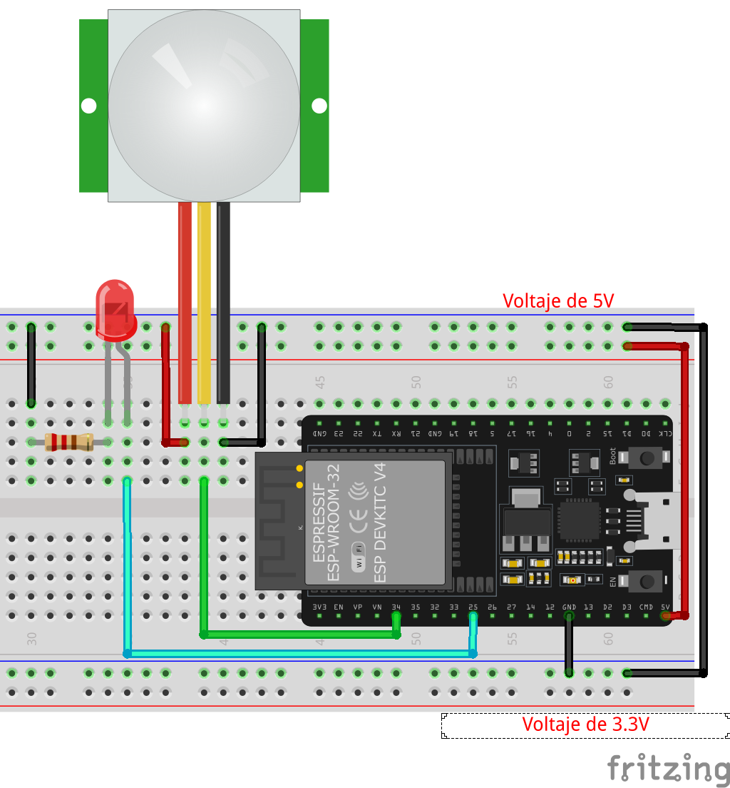
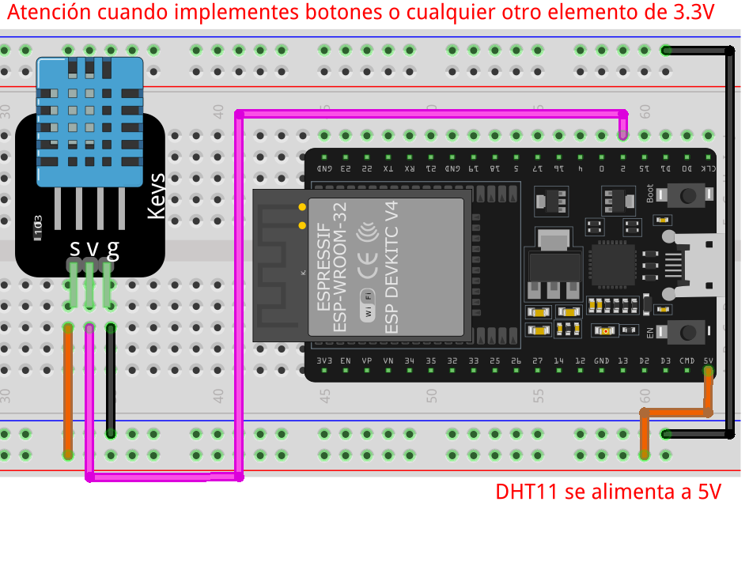

# Sensores -Aplicación

## Sensores digitales

Usaremos diversos sensores para controlar distintos elementos.

## Teclado 4x4

<!-- https://esp32io.com/tutorials/esp32-keypad -->

## Sensor PIR HC-SR501 (Sensor de presencia)



## Sensor de Temperatura y Humedad DTH11

!!! Warning Lib
    Se deben agregar una librerías para usar este sensor. [Click aquí](../assets/libs/Pack_DTHxx.zip), agregarlas a tu IDE, de lo contrario no funcionara el código de ejemplo.




```C
#include <Adafruit_Sensor.h>
#include <DHT.h>
#include <DHT_U.h>

#define DHTPIN 2     // El pin que se usara para comunicar al sensor con el micro

#define DHTTYPE    DHT11   // se define que sensor se usara (tenemos el DHT22, FHT21)

DHT_Unified dht(DHTPIN, DHTTYPE); // Se crea el objeto con los valores indicados para que se configure el sensor a usar

uint32_t delayMS;

void setup() {
  Serial.begin(115200);
  // Initialize device.
  dht.begin(); //inicializamos al sensor
  Serial.println(F("Sensor DHT11"));
  // Print temperature sensor details.
  sensor_t sensor;
  dht.temperature().getSensor(&sensor);
  Serial.println(F("------------------------------------"));
  Serial.println(F("Temperature Sensor"));
  Serial.print  (F("Sensor Tipo: ")); Serial.println(sensor.name);
  Serial.print  (F("Driver Ver:  ")); Serial.println(sensor.version);
  Serial.print  (F("ID:   ")); Serial.println(sensor.sensor_id);
  Serial.print  (F("Valor Max:   ")); Serial.print(sensor.max_value); Serial.println(F("°C"));
  Serial.print  (F("Valor Min:   ")); Serial.print(sensor.min_value); Serial.println(F("°C"));
  Serial.print  (F("Resolution:  ")); Serial.print(sensor.resolution); Serial.println(F("°C"));
  Serial.println(F("------------------------------------"));
  // Print humidity sensor details.
  dht.humidity().getSensor(&sensor);
  Serial.println(F("Humidity Sensor"));
  Serial.print  (F("Sensor Type: ")); Serial.println(sensor.name);
  Serial.print  (F("Driver Ver:  ")); Serial.println(sensor.version);
  Serial.print  (F("Unique ID:   ")); Serial.println(sensor.sensor_id);
  Serial.print  (F("Max Value:   ")); Serial.print(sensor.max_value); Serial.println(F("%"));
  Serial.print  (F("Min Value:   ")); Serial.print(sensor.min_value); Serial.println(F("%"));
  Serial.print  (F("Resolution:  ")); Serial.print(sensor.resolution); Serial.println(F("%"));
  Serial.println(F("------------------------------------"));
  // Set delay between sensor readings based on sensor details.
  delayMS = sensor.min_delay / 1000;
}

void loop() {
  // Delay between measurements.
  delay(delayMS);
  // Get temperature event and print its value.
  sensors_event_t event;
  dht.temperature().getEvent(&event);
  if (isnan(event.temperature)) {
    Serial.println(F("Error reading temperature!"));
  }
  else {
    Serial.print(F("Temperature: "));
    Serial.print(event.temperature);
    Serial.println(F("°C"));
  }
  // Get humidity event and print its value.
  dht.humidity().getEvent(&event);
  if (isnan(event.relative_humidity)) {
    Serial.println(F("Error reading humidity!"));
  }
  else {
    Serial.print(F("Humidity: "));
    Serial.print(event.relative_humidity);
    Serial.println(F("%"));
  }
}
```

## Sensor Ultrasónico HC-SR04

## Sensor DS18B - Sensor de temperatura

## Sensor de humedad de tierra

