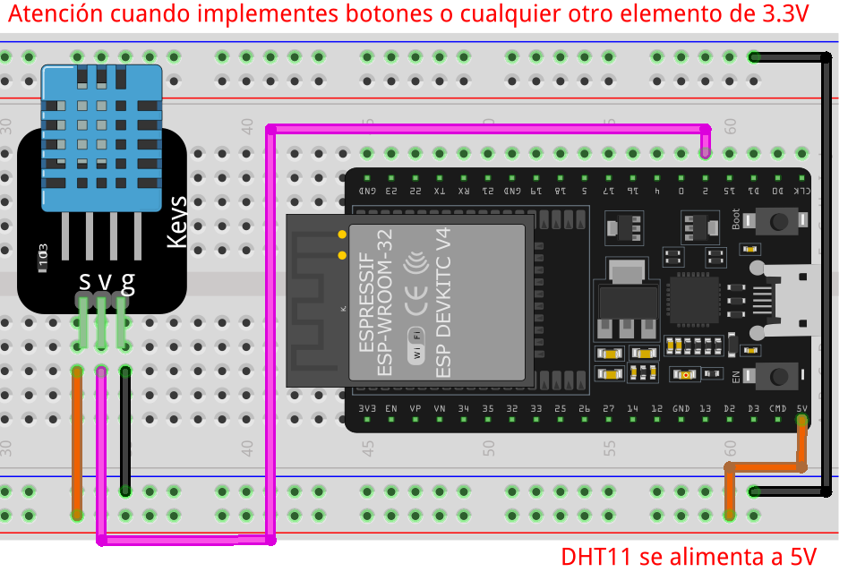

# Sensores - Aplicación

## Sensores digitales

Usaremos diversos sensores para controlar distintos elementos.

## Teclado matricial 4x4

Aquí vamos a probar el correcto conexionado y funcionamiento del teclado, imprimiendo por monitor serial la tecla presionada.

**Diagrama pictórico**


**Código**

```C
#include <Keypad.h> // importamos la librería para utilizar el teclado

#define ROW_NUM     4 // indicamos el numero de renglones del teclado
#define COLUMN_NUM  4 // indicamos el numero de columnas del teclado

char keys[ROW_NUM][COLUMN_NUM] = { // indicamos las letras que tiene el teclado, estas se pueden cambiar
  {'1', '2', '3', 'A'},
  {'4', '5', '6', 'B'},
  {'7', '8', '9', 'C'},
  {'*', '0', '#', 'D'}
};

byte pin_rows[ROW_NUM]      = {19, 18, 5, 17}; // indicamos los pines que se usaran para los renglones
byte pin_column[COLUMN_NUM] = {16, 4, 0, 2};   // indicamos los pines que se usaran para las columnas

Keypad keypad = Keypad( makeKeymap(keys), pin_rows, pin_column, ROW_NUM, COLUMN_NUM ); // se crea y configura el objeto para el uso del teclado

void setup() {
  Serial.begin(115200);
}

void loop() {
  char key = keypad.getKey(); // esperemos la tecla que se presiono

  if (key) { // si presionaron una tecla, entra al bloque del if
    Serial.println(key); // se imprime la tecla que fue presionada
  }
}

```

### Cerradura básica

Haremos una cerradura básica, en la cual si se colocar la contraseña correcta se encenderá un led 3 veces cada medio segundo, esto indica que la contraseña fue correctamente colocada.
En caso que la contraseña se incorrecta, parpadeara el led, indicando que la contraseña fue incorrecta.
Tendremos todo el feedback en el monitor serial.

**Diagrama pictórico**


**Código**

```C
#include <Keypad.h> // importamos la librería para utilizar el teclado

#define ROW_NUM     4 // indicamos el numero de renglones del teclado
#define COLUMN_NUM  4 // indicamos el numero de columnas del teclado

char keys[ROW_NUM][COLUMN_NUM] = { // indicamos las letras que tiene el teclado, estas se pueden cambiar
  {'1', '2', '3', 'A'},
  {'4', '5', '6', 'B'},
  {'7', '8', '9', 'C'},
  {'*', '0', '#', 'D'}
};

byte pin_rows[ROW_NUM]      = {19, 18, 5, 17}; // indicamos los pines que se usaran para los renglones
byte pin_column[COLUMN_NUM] = {16, 4, 0, 2};   // indicamos los pines que se usaran para las columnas

Keypad keypad = Keypad( makeKeymap(keys), pin_rows, pin_column, ROW_NUM, COLUMN_NUM );  // se crea y configura el objeto para el uso del teclado


const String password = "7890"; // Aquí el password super secreto
String input_password;

#define LED 25

void setup() {
  Serial.begin(115200);
  pinMode(LED, OUTPUT);
  Serial.println("------------------------");
  Serial.println("El password es de 4 digitos");
  Serial.println("Presionar # para aceptar el password");
  Serial.println("Presionar * para cancelar y volver a escribir el password");
  Serial.println("------------------------");
  Serial.println("Introduccir el password");
  Serial.println("------------------------");
}

void loop() {
  char key = keypad.getKey(); // esperemos la tecla que se presiono

  if (key) {
    Serial.print(key);

    if (key == '*') {
      input_password = ""; // clear input password
      Serial.println("cancelado");
      Serial.println("");
    } else if (key == '#') {
      Serial.println("");
      if (password == input_password) {
        Serial.println("The password CORRECTO!!");
        digitalWrite(LED, HIGH);
        delay(500);
        digitalWrite(LED, LOW);
        delay(500);
        digitalWrite(LED, HIGH);
        delay(500);
        digitalWrite(LED, LOW);
        delay(500);
        digitalWrite(LED, HIGH);
        delay(500);
        digitalWrite(LED, LOW);
        delay(500);
      } else {
        Serial.println("The password INCORRECTO!");
        digitalWrite(LED, HIGH);
        delay(250);
        digitalWrite(LED, LOW);
        delay(250);
        digitalWrite(LED, HIGH);
        delay(250);
        digitalWrite(LED, LOW);
        delay(250);
        digitalWrite(LED, HIGH);
        delay(250);
        digitalWrite(LED, LOW);
        delay(250);
      }
      Serial.println("------------------------");
      Serial.println("El password es de 4 digitos");
      Serial.println("Presionar # para aceptar el password");
      Serial.println("Presionar * para cancelar y volver a escribir el password");
      Serial.println("------------------------");
      Serial.println("Introduccir el password");
      Serial.println("------------------------");
      input_password = ""; // se limpia el contenido
    } else {
      input_password += key; // va juntando los caracteres
    }
  }
}

```

## Sensor PIR HC-SR501 (Sensor de presencia)


**Código**

```C
#define PIR 34 //defino el pin para el sensor PIR
#define LED 25 //defino el pin para el LED

void setup() {
  Serial.begin(115200);
  pinMode(PIR, INPUT);
  pinMode(LED, OUTPUT);

}

void loop() {
  if(digitalRead(PIR) == 1){
    digitalWrite(LED, HIGH);
    Serial.println("Hay presencia");
    delay(1000);
  }else{
    digitalWrite(LED, LOW);
  }
  delay(10);
}

```

## Sensor de Temperatura y Humedad DTH11

!!! Warning Librería
    Se deben agregar una librerías para usar este sensor. [Click aquí](../assets/libs/Pack_DTHxx.zip), agregarlas a tu IDE, de lo contrario no funcionara el código de ejemplo.





```C
#include <Adafruit_Sensor.h>
#include <DHT.h>
#include <DHT_U.h>

#define DHTPIN 2     // El pin que se usara para comunicar al sensor con el micro

#define DHTTYPE    DHT11   // se define que sensor se usara (tenemos el DHT22, FHT21)

DHT_Unified dht(DHTPIN, DHTTYPE); // Se crea el objeto con los valores indicados para que se configure el sensor a usar

uint32_t delayMS;

void setup() {
  Serial.begin(115200);
  // Initialize device.
  dht.begin(); //inicializamos al sensor
  Serial.println(F("Sensor DHT11"));
  // Print temperature sensor details.
  sensor_t sensor;
  dht.temperature().getSensor(&sensor);
  Serial.println(F("------------------------------------"));
  Serial.println(F("Temperature Sensor"));
  Serial.print  (F("Sensor Tipo: ")); Serial.println(sensor.name);
  Serial.print  (F("Driver Ver:  ")); Serial.println(sensor.version);
  Serial.print  (F("ID:   ")); Serial.println(sensor.sensor_id);
  Serial.print  (F("Valor Max:   ")); Serial.print(sensor.max_value); Serial.println(F("°C"));
  Serial.print  (F("Valor Min:   ")); Serial.print(sensor.min_value); Serial.println(F("°C"));
  Serial.print  (F("Resolution:  ")); Serial.print(sensor.resolution); Serial.println(F("°C"));
  Serial.println(F("------------------------------------"));
  // Print humidity sensor details.
  dht.humidity().getSensor(&sensor);
  Serial.println(F("Humidity Sensor"));
  Serial.print  (F("Sensor Type: ")); Serial.println(sensor.name);
  Serial.print  (F("Driver Ver:  ")); Serial.println(sensor.version);
  Serial.print  (F("Unique ID:   ")); Serial.println(sensor.sensor_id);
  Serial.print  (F("Max Value:   ")); Serial.print(sensor.max_value); Serial.println(F("%"));
  Serial.print  (F("Min Value:   ")); Serial.print(sensor.min_value); Serial.println(F("%"));
  Serial.print  (F("Resolution:  ")); Serial.print(sensor.resolution); Serial.println(F("%"));
  Serial.println(F("------------------------------------"));
  // Set delay between sensor readings based on sensor details.
  delayMS = sensor.min_delay / 1000;
}

void loop() {
  // Delay between measurements.
  delay(delayMS);
  // Get temperature event and print its value.
  sensors_event_t event;
  dht.temperature().getEvent(&event);
  if (isnan(event.temperature)) {
    Serial.println(F("Error reading temperature!"));
  }
  else {
    Serial.print(F("Temperature: "));
    Serial.print(event.temperature);
    Serial.println(F("°C"));
  }
  // Get humidity event and print its value.
  dht.humidity().getEvent(&event);
  if (isnan(event.relative_humidity)) {
    Serial.println(F("Error reading humidity!"));
  }
  else {
    Serial.print(F("Humidity: "));
    Serial.print(event.relative_humidity);
    Serial.println(F("%"));
  }
}
```

## Sensor Ultrasónico HC-SR04

!!! Note **Descargar la librería**

    Agregar la librería de manera manual. [Dar click aquí](../assets/libs/NewPing.zip)

!!! Note **Instalación de la librería**
    Abrir el "Gestor de Librerías" y buscar como se muestra.

    

### Distancia con sensor Ultrasónico


```C
#include <NewPing.h>

#define TRIGGER_PIN  4  // Pin que se usara para el TRIGGER que recibe el sensor
#define ECHO_PIN     2  // Pin que se usara el el ECHO que enviara el sensor
#define MAX_DISTANCE 400 // Distancia maxima que puede medir el sensor

NewPing ultrasonico(TRIGGER_PIN, ECHO_PIN, MAX_DISTANCE); // Se configura el objeto del sensor que usara los datos

void setup() {
  Serial.begin(115200);
}

float duracion, distancia;

void loop() {

  duracion = ultrasonico.ping();

  distancia = (duracion / 2) * 0.0343;
  Serial.print("Distancia: ");

  if (distancia >= 400 || distancia <= 2) {
    Serial.println("Fuera de rango");
  } else {
    Serial.print(distancia);
    Serial.println(" cm");
    delay(500);
  }

  delay(500);
}
```

### Barra de leds con Ultrasonico


```C
#include <NewPing.h>

#define TRIGGER_PIN  4  // Pin que se usara para el TRIGGER que recibe el sensor
#define ECHO_PIN     2  // Pin que se usara el el ECHO que enviara el sensor
#define MAX_DISTANCE 400 // Distancia maxima que puede medir el sensor

NewPing ultrasonico(TRIGGER_PIN, ECHO_PIN, MAX_DISTANCE); // Se configura el objeto del sensor que usara los datos

#define NO_LEDS 7
const int PINS[] = {32, 33, 25, 26, 27, 12, 14}; //pines para leds


void setup() {
  Serial.begin(115200);
  for (char x = 0; x < NO_LEDS; x++) {
    pinMode(PINS[x], OUTPUT);
  }
}

void loop() {

  float distancia = (ultrasonico.ping() / 2) * 0.0343;
  Serial.print("Distancia: ");

  if (distancia >= 400 || distancia <= 2) {
    Serial.println("Fuera de rango");

    for (char x = 0; x < NO_LEDS; x++) {
      digitalWrite(PINS[x], HIGH);
    }
    delay(250);
    for (char x = 0; x < NO_LEDS; x++) {
      digitalWrite(PINS[x], LOW);
    }
    delay(250);

  } else {
    Serial.print(distancia);
    Serial.println(" cm");

    if (distancia < 50) {
      const int LEVEL = 1;

      for (char x = 0; x < LEVEL; x++) {
        digitalWrite(PINS[x], HIGH);
      }
      delay(100);
      for (char x = LEVEL; x < NO_LEDS; x++) {
        digitalWrite(PINS[x], LOW);
      }
    } else if (distancia >= 50 && distancia < 100) {
      const int LEVEL = 2;

      for (char x = 0; x < LEVEL; x++) {
        digitalWrite(PINS[x], HIGH);
      }
      delay(100);
      for (char x = LEVEL; x < NO_LEDS; x++) {
        digitalWrite(PINS[x], LOW);
      }
    } else if (distancia >= 100 && distancia < 150) {
      const int LEVEL = 3;

      for (char x = 0; x < LEVEL; x++) {
        digitalWrite(PINS[x], HIGH);
      }
      delay(100);
      for (char x = LEVEL; x < NO_LEDS; x++) {
        digitalWrite(PINS[x], LOW);
      }
    } else if (distancia >= 150 && distancia < 200) {
      const int LEVEL = 4;

      for (char x = 0; x < LEVEL; x++) {
        digitalWrite(PINS[x], HIGH);
      }
      delay(100);
      for (char x = LEVEL; x < NO_LEDS; x++) {
        digitalWrite(PINS[x], LOW);
      }
    } else if (distancia >= 200 && distancia < 250) {
      const int LEVEL = 5;

      for (char x = 0; x < LEVEL; x++) {
        digitalWrite(PINS[x], HIGH);
      }
      delay(100);
      for (char x = LEVEL; x < NO_LEDS; x++) {
        digitalWrite(PINS[x], LOW);
      }
    } else if (distancia >= 250 && distancia < 300) {
      const int LEVEL = 6;

      for (char x = 0; x < LEVEL; x++) {
        digitalWrite(PINS[x], HIGH);
      }
      delay(100);
      for (char x = LEVEL; x < NO_LEDS; x++) {
        digitalWrite(PINS[x], LOW);
      }
    } else {
      const int LEVEL = 7;

      for (char x = 0; x < LEVEL; x++) {
        digitalWrite(PINS[x], HIGH);
      }
      delay(100);
      for (char x = LEVEL; x < NO_LEDS; x++) {
        digitalWrite(PINS[x], LOW);
      }
    }
    delay(500);
  }

  delay(10);
}
```

## Sensor DS18B20 - Sensor de temperatura

!!! Note **Descargar la librería**

    Agregar la librería de manera manual. [Dar click aquí](../assets/libs/DS18B20.zip)

!!! Note **Instalación de la librería**
    Abrir el "Gestor de Librerías" y buscar como se muestra.

    

    

!!! warning Resistencia pull-up
    Se necesita agregarle una resistencia de pull-up al pin de señal, de lo contrario funcionara mal.
    `La resistencia es de` $4.7k\Omega$


<details markdown="1">
<summary>Pines DS18B20</summary>
  Descripción del encapsulado. Hacer los ajustes necesarios

  

</details>


Vamos a realizar un lectura básica de la temperatura con el sensor de Dallas DS18B20 y mandar el valor al monitor serial


**Diagrama pictórico**


**Código**

```C
// Se deben incluir estas librerías para el control del sensor
#include <OneWire.h> // conexión de one wire para la comunicación
#include <DallasTemperature.h> // lib que se encarga de transformar el dato al valor de temperatura

// definimos el pin que usaremos para la comunicación con el sensor
#define ONE_WIRE_BUS 25

// se configura la instancia (el objeto) para la comunicación con el protocolo one wire
OneWire oneWire(ONE_WIRE_BUS);

// se pasa la referencia a la lib de Dallas, que recibirá los datos del sensor y hacer la conversión
DallasTemperature sensors(&oneWire);

void setup(void) {
  Serial.begin(115200); // Se configura la comunicación serial

  //se arranca y configura la comunicación con el sensor de temperatura
  sensors.begin();
}

void loop(void) {
  Serial.print("Obteniendo temperatura...");
  sensors.requestTemperatures(); // se hace la solicitud de temperatura al sensor

  // se obtiene la temperatura en grados Celsius del sensor que hay (se le pasa 0 porque solo tenemos un sensor)
  float tempC = sensors.getTempCByIndex(0);

  // se verifica si el valor es correcto
  if (tempC != DEVICE_DISCONNECTED_C) {
    Serial.print("La temperatura es: ");
    Serial.println(tempC);
  }
  else  {
    Serial.println("Error: No se pudo obtener el valor de temperatura");
  }
  delay(5000);
}
```

## Sensor de Sonido

Vamos a realizar un interruptor por aplausos, con dos aplausos se prende y con otros 2 se apaga el led.

**Diagrama Pictórico**


**Código**

```C
//CODIGO NO PROBADO
#define MICROPHONE 34
#define LED 25
int clap = 0;
long detection_range_start = 0;
long detection_range = 0;
boolean status_lights = false;

void setup() {
  pinMode(MICROPHONE, INPUT);
  pinMode(LED, OUTPUT);
}

void loop() {
  int status_microphone = digitalRead(MICROPHONE);

  if (status_microphone == 0) {
    if (clap == 0) {
      detection_range_start = detection_range = millis();
      clap++;
    }
    else if (clap > 0 && millis() - detection_range >= 50) {
      detection_range = millis();
      clap++;
    }
  }

  if (millis() - detection_range_start >= 400) {
    if (clap == 2) {
      if (!status_lights) {
        status_lights = true;
        digitalWrite(LED, HIGH);
      }
      else if (status_lights) {
        status_lights = false;
        digitalWrite(LED, LOW);
      }
    }
    clap = 0;
  }
}
```

## Sensor de humedad de tierra


### Tarjeta RFID