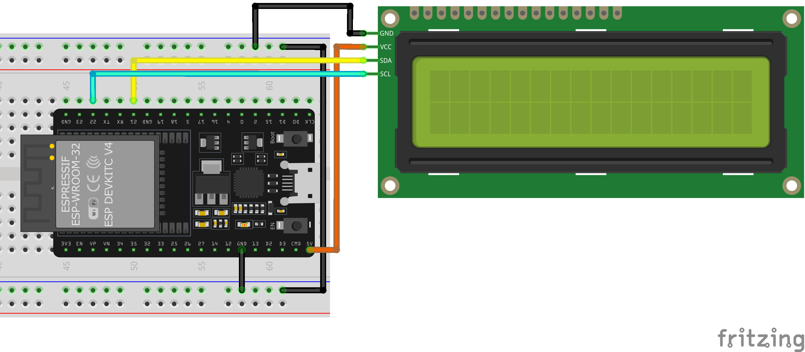

# Pantallas

## Pantalla LCD con comunicación I^2^C

La pantalla LCD es una pantalla de cristal liquido, su controlador mas común es el [HD44780](https://www.sparkfun.com/datasheets/LCD/HD44780.pdf), su comunicación puede ser de 4 bits u 8 bits. Dado que si nos comunicamos con 8 bits, implica usar 8 pines del microcontrolador, o en su defecto si usamos la comunicación de 4 bits, se usarían 4 pines, y en ocasiones dependiendo del microcontrolador, no nos podemos dar el lujo de usar tantos, surgió un modulo de comunicación I^2^C, que implica solo usar 2 pines para el control total de toda la pantalla.

Los tamaños mas comunes de pantalla son 

- 16x2: 16 caracteres de forma horizontal y 2 renglones
- 20x4: 20 caracteres de forma horizontal y 4 renglones

El control es exactamente igual, obviamente se debe especificar en que sitio se colocara el carácter.

Cada carácter esta formado de 5x7 pixels, es decir, podemos dar la forma o figura que quisiéramos por cada carácter y hacer combinaciones infinitas (inclusive hacer juegos)

La comunicación I^2^C nos reduce el uso de pines, pero esto incrementa el uso de mas hardware o librerías para implementar el protocolo.

El controlador es el PCF8574 el encargado de recibir la informacion y comunicarla al microcontrolador de la LCD, realizando las acciones que enviamos por el protocolo.

En la comunicación I^2^C es un protocolo tipo Maestro-Esclavo, y cada esclavo tiene un ID único (dirección), para saber a que dispositivo le estamos solicitando la información y de quien estamos recibiendo.

Al igual en este modulo incorpora un trimpot para ajustar el contraste de la pantalla, el jumper para el brillo de la pantalla y el selector de dirección (es la modificación de una resistencia)

## Pines de la LCD con I^2^C

!!! Warning Cuidado
    Los pines a los que se conectan los pines de `SDA` y `SCL` de la pantalla Iran a:

    |LCD | ESP32|
    |---|---|
    |SDA| GPIO21| 
    |SCL| GPIO22|
    |VCC| 5V|
    |GND| GND|

]

## Algoritmos de encendido de pantalla

Estos son los pasos que siempre Iran al inicio para arrancar la pantalla.

1. Función `init()`: Solo se llama al inicio para arrancar la pantalla
2. Función `backlight()`: Enciende la luz de fondo (depende si quieres prenderla)
3. Función `clear()`: Limpia la pantalla de cualquier ruido o carácter raro que salga en pantalla
4. Función `setCursor(column, row)` 

Ya posicionados, podemos comenzar a escribir el mensaje en pantalla.

https://lastminuteengineers.com/esp32-i2c-lcd-tutorial/

### Ejemplos

#### Voltímetro

----

## OLED 

check https://github.com/durydevelop/arduino-lib-oled