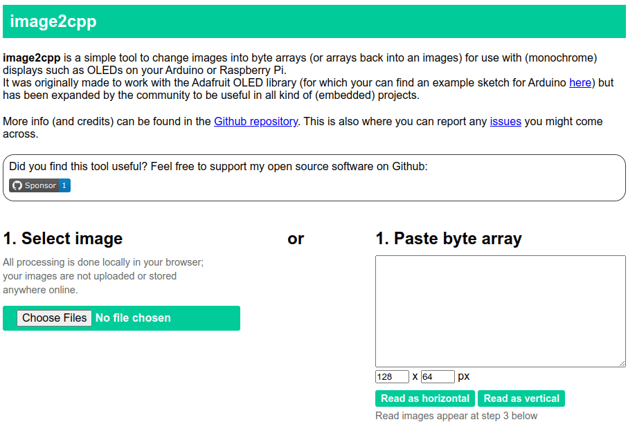

# Pantallas

## Pantalla LCD con comunicación I^2^C

La pantalla LCD es una pantalla de cristal liquido, su controlador mas común es el [HD44780](https://www.sparkfun.com/datasheets/LCD/HD44780.pdf), su comunicación puede ser de 4 bits u 8 bits. Dado que si nos comunicamos con 8 bits, implica usar 8 pines del microcontrolador, o en su defecto si usamos la comunicación de 4 bits, se usarían 4 pines, y en ocasiones dependiendo del microcontrolador, no nos podemos dar el lujo de usar tantos, surgió un modulo de comunicación I^2^C, que implica solo usar 2 pines para el control total de toda la pantalla.


Los tamaños mas comunes de pantalla son 

- 16x2: 16 caracteres de forma horizontal y 2 renglones
- 20x4: 20 caracteres de forma horizontal y 4 renglones


El control es exactamente igual, obviamente se debe especificar en que sitio se colocara el carácter.

Cada carácter esta formado de 5x7 pixels, es decir, podemos dar la forma o figura que quisiéramos por cada carácter y hacer combinaciones infinitas (inclusive hacer juegos)


La comunicación I^2^C nos reduce el uso de pines, pero esto incrementa el uso de mas hardware o librerías para implementar el protocolo.


El controlador es el PCF8574 el encargado de recibir la informacion y comunicarla al microcontrolador de la LCD, realizando las acciones que enviamos por el protocolo.


En la comunicación I^2^C es un protocolo tipo Maestro-Esclavo, y cada esclavo tiene un ID único (dirección), para saber a que dispositivo le estamos solicitando la información y de quien estamos recibiendo.

Al igual en este modulo incorpora un trimpot para ajustar el contraste de la pantalla, el jumper para el brillo de la pantalla y el selector de dirección (es la modificación de una resistencia)


### Referencias

https://naylampmechatronics.com/oled/638-display-oled-i2c-130-12864-sh1106.html

## Pines de la LCD con I^2^C


!!! Warning Conexión
    Los pines a los que se conectan los pines de `SDA` y `SCL` de la pantalla Iran a:

    |LCD | ESP32|
    |---|---|
    |SDA| GPIO21| 
    |SCL| GPIO22|
    |VCC| 5V|
    |GND| GND|

]


!!! Warning Librería
    Descargar la librería para poder comunicar el ESP32 con el módulo I^2^C. Agregarla a Arduino IDE.
    [Dar click aquí](../assets/libs/LiquidCrystal-I2C.zip)

!!! Note Nota
    Si al arrancar la pantalla no se ve nada, recuerda mover el tripot para el contraste.

## Algoritmos de encendido de pantalla

Estos son los pasos que siempre Iran al inicio para arrancar la pantalla.

1. Función `begin()`: Solo se llama al inicio para arrancar la pantalla
2. Función `backlight()`: Enciende la luz de fondo (depende si quieres prenderla)
3. Función `clear()`: Limpia la pantalla de cualquier ruido o carácter raro que salga en pantalla
4. Función `setCursor(column, row)` 

Ya posicionados, podemos comenzar a escribir el mensaje en pantalla.


https://lastminuteengineers.com/esp32-i2c-lcd-tutorial/

### Visualización de mensaje

Se mandara un mensaje a la pantalla, línea por línea.

**Diagrama Pictórico**


```C
#include <Wire.h>
#include <LiquidCrystal_I2C.h>

// Set the LCD address to 0x27 for a 16 chars and 2 line display
LiquidCrystal_I2C lcd(0x27, 16, 2);

void setup()
{
  // inicializamos la pantalla para comunicación 
  lcd.begin();
  // Enciende la luz de fondo pantalla
  lcd.backlight();
  //Por default comenzará a escribir en la posición x=0,y=0
  //se manda el siguiente texto a la pantalla
  lcd.print("Mecatronica 85"); //no se ponen acentos 
  //Nos movemos al segundo renglón, en la primera posición
  lcd.setCursor(0, 1);
  //se manda el siguiente texto a la pantalla
  lcd.print("Rules");
}

void loop()
{
  // Aquí no colocamos nada
}
```

#### Voltímetro

Realizaremos un voltímetro sencillo y básico, donde vamos a leer el voltaje de un divisor de tension.

Para ello debemos aplicar una formula donde vamos a convertir el valor que se recibe del ADC a un valor equivalente de voltaje, como tenemos un potenciómetro lineal, la relación es directa, quedando la formula

$$voltaje = ADC_{bit} \frac{3.3V}{4095_{bit}}$$

Con esta formula estamos convirtiendo lo que recibimos en la entrada del ADC a lo correspondiente de voltaje.

Como el valor máximo de voltaje es 3.3V, esto se divide entre la resolución del ADC y lo multiplicamos por el valor leído.

**Diagrama pictórico**


<picture width="100%" markdown="1">
  <source srcset="../assets/videos/voltimetro.webp" type="image/webp">


  
</picture>

**Código básico**

```C
#include <Wire.h>
#include <LiquidCrystal_I2C.h>

// Set the LCD address to 0x27 for a 16 chars and 2 line display
LiquidCrystal_I2C lcd(0x27, 16, 2);
#define PIN_ADC 34


void setup(){
  // inicializamos la pantalla para comunicación 
  lcd.begin();
  // Enciende la luz de fondo pantalla
  lcd.backlight();
  //Por default comenzará a escribir en la posición x=0,y=0
  //se manda el siguiente texto a la pantalla
  lcd.print("Mecatronica 85");
  //Nos movemos al segundo renglón, en la primera posición
  lcd.setCursor(0, 1);
  //se manda el siguiente texto a la pantalla
  lcd.print("Voltimetro");
  delay(1000); //esperamos un segundo para el mensaje de bienvenida
  lcd.clear(); //limpiamos la pantalla
  lcd.setCursor(0,0); //regresamos a la posición inicial
  lcd.print("Voltimetro 85");
  lcd.setCursor(15,1);  //nos movemos a la columna 15 y la ultima posición
  lcd.print("V"); //colocamos la unidad del voltaje (V)
}

void loop(){
  int valorADC = analogRead(PIN_ADC);
  delay(10); //esperamos un momento de estabilización del dato
  float voltaje = (valorADC * 3.3) / 4095.0; //convertimos el valor a voltaje
  lcd.setCursor(11,1); //nos colocamos en la parte para que el numero salga al final al lado de la "V"
  lcd.print(voltaje);
  delay(50);
}
```

**Código más estable**

Este código es más eficiente para tener una valor más estable. Aplicamos un promedio de la muestra. Con esto hacemos que el valor que se muestra se más conciso.

```C
#include <Wire.h>
#include <LiquidCrystal_I2C.h>

// Set the LCD address to 0x27 for a 16 chars and 2 line display
LiquidCrystal_I2C lcd(0x27, 16, 2);
#define PIN_ADC 34


void setup() {
  // inicializamos la pantalla para comunicación
  lcd.begin();
  // Enciende la luz de fondo pantalla
  lcd.backlight();
  //Por default comenzará a escribir en la posición x=0,y=0
  //se manda el siguiente texto a la pantalla
  lcd.print("Mecatronica 85");
  //Nos movemos al segundo renglón, en la primera posición
  lcd.setCursor(0, 1);
  //se manda el siguiente texto a la pantalla
  lcd.print("Voltimetro");
  delay(1000); //esperamos un segundo para el mensaje de bienvenida
  lcd.clear(); //limpiamos la pantalla
  lcd.setCursor(0, 0); //regresamos a la posición inicial
  lcd.print("Voltimetro 85");
  lcd.setCursor(15, 1); //nos movemos a la columna 15 y la ultima posición
  lcd.print("V"); //colocamos la unidad del voltaje (V)
}

#define MUESTRAS 60.0 // defino una cantidad de muestras que se tomaran para el promedio

void loop() {
  int valorADC = 0;     //aquí guardaremos el valor del ADC
  int suma = 0;         //acumulara el valor de las muestras del ADC
  for (byte x = 0; x < MUESTRAS; x++) {
    valorADC = analogRead(PIN_ADC);
    suma += valorADC;
    delay(5); //esperamos un momento de estabilización del dato
  }
  float promedio = suma / MUESTRAS;
  float voltaje = (valorADC * 3.3) / 4095.0; //convertimos el valor a voltaje
  lcd.setCursor(11, 1); //nos colocamos en la parte para que el numero salga al final al lado de la "V"
  lcd.print(voltaje);

}
```
----

## OLED 

Las pantalla OLED se han popularizado mucho últimamente, y gracias a Adafruit se ha economizado mucho.

Nos da una amplia gama de aplicación en diversas situaciones, como realizar estaciones meteorológicas, un contador para nuestros suscriptores de YT, juegos, etc.


Contamos con 2 drivers, los mas comunes son:

-  SSD1306
-  SH110X

Con dos protocolos, estos son

- I^2^C
- SPI


!!! Note Nota
    Aquí debes probar en caso de no conocer cual es el driver de tuu pantalla OLED, en mi caso tengo con driver: **SH110X con I^2^C**

!!! Warning Conexión
    Los pines a los que se conectan los pines de `SDA` y `SCL` de la pantalla Iran a:

    |OLED | ESP32|
    |---|---|
    |SDA| GPIO21| 
    |SCL| GPIO22|
    |VDD| 3V3|
    |GND| GND|


!!! Warning Librería
    Las librerías que se necesitan son varias, si estas con el gestor e instalar en la carpeta de `librerías` del IDE de Arduino. [Descargar aquí](../assets/libs/oled_ssd%26shx.zip) y las agregamos de manera manual.


<details markdown="1">
<summary markdown="1"> Instalando desde el **Gestor de librerías** </summary>

**Buscamos por "oled" e instalamos las siguientes e instalamos las librerías adiciones**


</details>

### Convertidores de imágenes para la pantalla

- [image2cpp](https://javl.github.io/image2cpp/) [web]

 

- [LCD Image Converter](https://lcd-image-converter.riuson.com/en/about/) [Desktop]


[Descargar](https://sourceforge.net/projects/lcd-image-converter/files/)

[Para conocer mas, ingresa a la documentación oficial de Adafruit](https://github.com/adafruit/Adafruit-GFX-Library)

#### Assets

La imagen demo que sale al inicio


#### Probando la OLED 

Se realizara demo simple de uso de la pantalla OLED

**Diagrama Pictórico**


```C
// Para la pantalla SH110X
#include <SPI.h>
#include <Wire.h>
#include <Adafruit_GFX.h>
#include <Adafruit_SH110X.h>

#define i2c_Address 0x3c //initialize with the I2C addr 0x3C Typically eBay OLED's
//#define i2c_Address 0x3d //initialize with the I2C addr 0x3D Typically Adafruit OLED's

#define SCREEN_WIDTH 128 // OLED display width, in pixels
#define SCREEN_HEIGHT 64 // OLED display height, in pixels
#define OLED_RESET -1   //   QT-PY / XIAO
Adafruit_SH1106G display = Adafruit_SH1106G(SCREEN_WIDTH, SCREEN_HEIGHT, &Wire, OLED_RESET);


#define NUMFLAKES 10
#define XPOS 0
#define YPOS 1
#define DELTAY 2


#define LOGO16_GLCD_HEIGHT 16
#define LOGO16_GLCD_WIDTH  16
static const unsigned char PROGMEM logo16_glcd_bmp[] = {
  0x06, 0x60,
  0x06, 0x60,
  0x3f, 0xfc,
  0x20, 0x04,
  0x20, 0x04,
  0xee, 0x77,
  0xea, 0x47,
  0x2a, 0x44,
  0x2e, 0x74,
  0xea, 0x17,
  0xea, 0x17,
  0x2e, 0x74,
  0x20, 0x04,
  0x3f, 0xfc,
  0x06, 0x60,
  0x06, 0x60
};


void setup()   {

  Serial.begin(115200);

  delay(250); // wait for the OLED to power up
  display.begin(i2c_Address, true); // Address 0x3C default
  //display.setContrast (0); // dim display

  display.display();
  delay(2000);

  // limpia la pantalla
  display.clearDisplay();

  // dibuja un pixel
  display.drawPixel(10, 10, SH110X_WHITE);
  // Show the display buffer on the hardware.
  // NOTE: You _must_ call display after making any drawing commands
  // to make them visible on the display hardware!
  display.display();
  delay(2000);
  display.clearDisplay();

  // dibuja muchas lineas
  testdrawline();
  display.display();
  delay(2000);
  display.clearDisplay();

  // dibuja rectangulos
  testdrawrect();
  display.display();
  delay(2000);
  display.clearDisplay();

  // dibuja multiples rectangulos
  testfillrect();
  display.display();
  delay(2000);
  display.clearDisplay();

  // dibuja multiples circulos
  testdrawcircle();
  display.display();
  delay(2000);
  display.clearDisplay();

  // dibuja un circulo de 10px de radio SH110X_WHITE
  display.fillCircle(display.width() / 2, display.height() / 2, 10, SH110X_WHITE);
  display.display();
  delay(2000);
  display.clearDisplay();

  testdrawroundrect();
  delay(2000);
  display.clearDisplay();

  testfillroundrect();
  delay(2000);
  display.clearDisplay();

  testdrawtriangle();
  delay(2000);
  display.clearDisplay();

  testfilltriangle();
  delay(2000);
  display.clearDisplay();

  // dibuja las primeras 12 letras en una fuente
  testdrawchar();
  display.display();
  delay(2000);
  display.clearDisplay();

  // Muestra texto
  display.setTextSize(1);
  display.setTextColor(SH110X_WHITE);
  display.setCursor(0, 0);
  display.println("Failure is always an option");
  display.setTextColor(SH110X_BLACK, SH110X_WHITE); // 'inverted' text
  display.println(3.141592);
  display.setTextSize(2);
  display.setTextColor(SH110X_WHITE);
  display.print("0x"); display.println(0xDEADBEEF, HEX);
  display.display();
  delay(2000);
  display.clearDisplay();

  // muestra la imagen (logo)
  display.drawBitmap(30, 16,  logo16_glcd_bmp, 16, 16, 1);
  display.display();
  delay(1);

  // invierte el color del display
  display.invertDisplay(true);
  delay(1000);
  display.invertDisplay(false);
  delay(1000);
  display.clearDisplay();

  // dibuja el icono bitmap en un movimiento animado
  testdrawbitmap(logo16_glcd_bmp, LOGO16_GLCD_HEIGHT, LOGO16_GLCD_WIDTH);
}


void loop() {

}


void testdrawbitmap(const uint8_t *bitmap, uint8_t w, uint8_t h) {
  uint8_t icons[NUMFLAKES][3];

  // initialize
  for (uint8_t f = 0; f < NUMFLAKES; f++) {
    icons[f][XPOS] = random(display.width());
    icons[f][YPOS] = 0;
    icons[f][DELTAY] = random(5) + 1;

    Serial.print("x: ");
    Serial.print(icons[f][XPOS], DEC);
    Serial.print(" y: ");
    Serial.print(icons[f][YPOS], DEC);
    Serial.print(" dy: ");
    Serial.println(icons[f][DELTAY], DEC);
  }

  while (1) {
    // draw each icon
    for (uint8_t f = 0; f < NUMFLAKES; f++) {
      display.drawBitmap(icons[f][XPOS], icons[f][YPOS], bitmap, w, h, SH110X_WHITE);
    }
    display.display();
    delay(200);

    // then erase it + move it
    for (uint8_t f = 0; f < NUMFLAKES; f++) {
      display.drawBitmap(icons[f][XPOS], icons[f][YPOS], bitmap, w, h, SH110X_BLACK);
      // move it
      icons[f][YPOS] += icons[f][DELTAY];
      // if its gone, reinit
      if (icons[f][YPOS] > display.height()) {
        icons[f][XPOS] = random(display.width());
        icons[f][YPOS] = 0;
        icons[f][DELTAY] = random(5) + 1;
      }
    }
  }
}


void testdrawchar(void) {
  display.setTextSize(1);
  display.setTextColor(SH110X_WHITE);
  display.setCursor(0, 0);

  for (uint8_t i = 0; i < 168; i++) {
    if (i == '\n') continue;
    display.write(i);
    if ((i > 0) && (i % 21 == 0))
      display.println();
  }
  display.display();
  delay(1);
}

void testdrawcircle(void) {
  for (int16_t i = 0; i < display.height(); i += 2) {
    display.drawCircle(display.width() / 2, display.height() / 2, i, SH110X_WHITE);
    display.display();
    delay(1);
  }
}

void testfillrect(void) {
  uint8_t color = 1;
  for (int16_t i = 0; i < display.height() / 2; i += 3) {
    // alternate colors
    display.fillRect(i, i, display.width() - i * 2, display.height() - i * 2, color % 2);
    display.display();
    delay(1);
    color++;
  }
}

void testdrawtriangle(void) {
  for (int16_t i = 0; i < min(display.width(), display.height()) / 2; i += 5) {
    display.drawTriangle(display.width() / 2, display.height() / 2 - i,
                         display.width() / 2 - i, display.height() / 2 + i,
                         display.width() / 2 + i, display.height() / 2 + i, SH110X_WHITE);
    display.display();
    delay(1);
  }
}

void testfilltriangle(void) {
  uint8_t color = SH110X_WHITE;
  for (int16_t i = min(display.width(), display.height()) / 2; i > 0; i -= 5) {
    display.fillTriangle(display.width() / 2, display.height() / 2 - i,
                         display.width() / 2 - i, display.height() / 2 + i,
                         display.width() / 2 + i, display.height() / 2 + i, SH110X_WHITE);
    if (color == SH110X_WHITE) color = SH110X_BLACK;
    else color = SH110X_WHITE;
    display.display();
    delay(1);
  }
}

void testdrawroundrect(void) {
  for (int16_t i = 0; i < display.height() / 2 - 2; i += 2) {
    display.drawRoundRect(i, i, display.width() - 2 * i, display.height() - 2 * i, display.height() / 4, SH110X_WHITE);
    display.display();
    delay(1);
  }
}

void testfillroundrect(void) {
  uint8_t color = SH110X_WHITE;
  for (int16_t i = 0; i < display.height() / 2 - 2; i += 2) {
    display.fillRoundRect(i, i, display.width() - 2 * i, display.height() - 2 * i, display.height() / 4, color);
    if (color == SH110X_WHITE) color = SH110X_BLACK;
    else color = SH110X_WHITE;
    display.display();
    delay(1);
  }
}

void testdrawrect(void) {
  for (int16_t i = 0; i < display.height() / 2; i += 2) {
    display.drawRect(i, i, display.width() - 2 * i, display.height() - 2 * i, SH110X_WHITE);
    display.display();
    delay(1);
  }
}

void testdrawline() {
  for (int16_t i = 0; i < display.width(); i += 4) {
    display.drawLine(0, 0, i, display.height() - 1, SH110X_WHITE);
    display.display();
    delay(1);
  }
  for (int16_t i = 0; i < display.height(); i += 4) {
    display.drawLine(0, 0, display.width() - 1, i, SH110X_WHITE);
    display.display();
    delay(1);
  }
  delay(250);

  display.clearDisplay();
  for (int16_t i = 0; i < display.width(); i += 4) {
    display.drawLine(0, display.height() - 1, i, 0, SH110X_WHITE);
    display.display();
    delay(1);
  }
  for (int16_t i = display.height() - 1; i >= 0; i -= 4) {
    display.drawLine(0, display.height() - 1, display.width() - 1, i, SH110X_WHITE);
    display.display();
    delay(1);
  }
  delay(250);

  display.clearDisplay();
  for (int16_t i = display.width() - 1; i >= 0; i -= 4) {
    display.drawLine(display.width() - 1, display.height() - 1, i, 0, SH110X_WHITE);
    display.display();
    delay(1);
  }
  for (int16_t i = display.height() - 1; i >= 0; i -= 4) {
    display.drawLine(display.width() - 1, display.height() - 1, 0, i, SH110X_WHITE);
    display.display();
    delay(1);
  }
  delay(250);

  display.clearDisplay();
  for (int16_t i = 0; i < display.height(); i += 4) {
    display.drawLine(display.width() - 1, 0, 0, i, SH110X_WHITE);
    display.display();
    delay(1);
  }
  for (int16_t i = 0; i < display.width(); i += 4) {
    display.drawLine(display.width() - 1, 0, i, display.height() - 1, SH110X_WHITE);
    display.display();
    delay(1);
  }
  delay(250);
}
```

#### Voltímetro

Realizaremos un voltímetro sencillo y básico, donde vamos a leer el voltaje de un divisor de tension.

Para ello debemos aplicar una formula donde vamos a convertir el valor que se recibe del ADC a un valor equivalente de voltaje, como tenemos un potenciómetro lineal, la relación es directa, quedando la formula

$$voltaje = ADC_{bit} \frac{3.3V}{4095_{bit}}$$

Con esta formula estamos convirtiendo lo que recibimos en la entrada del ADC a lo correspondiente de voltaje.

Como el valor máximo de voltaje es 3.3V, esto se divide entre la resolución del ADC y lo multiplicamos por el valor leído.

Haciendo uso de una pantalla OLED

**Diagrama pictórico**

