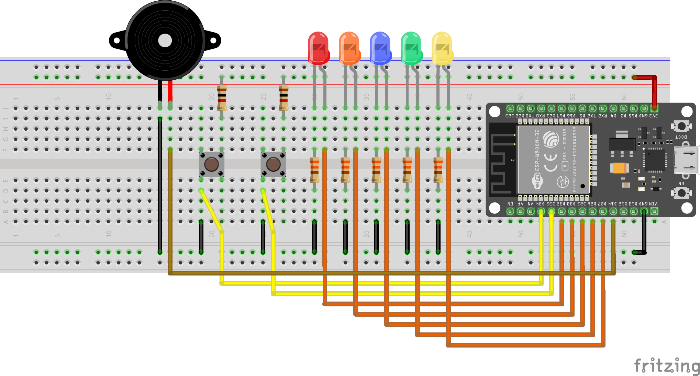
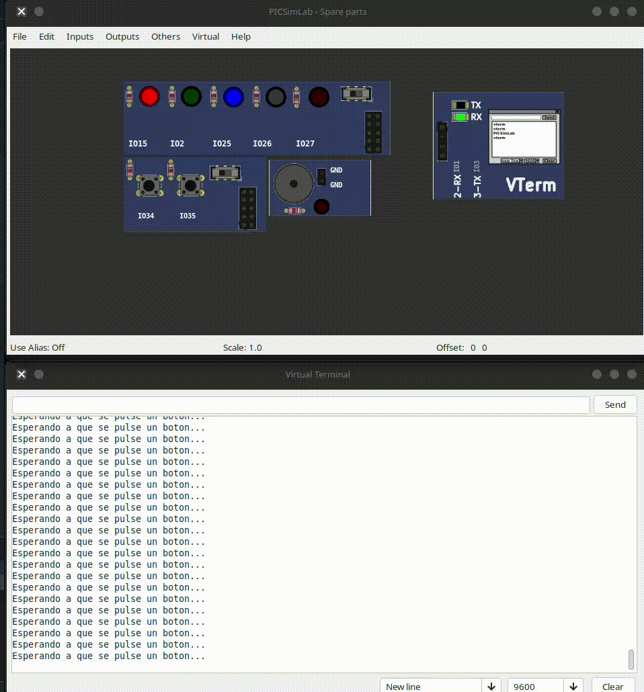
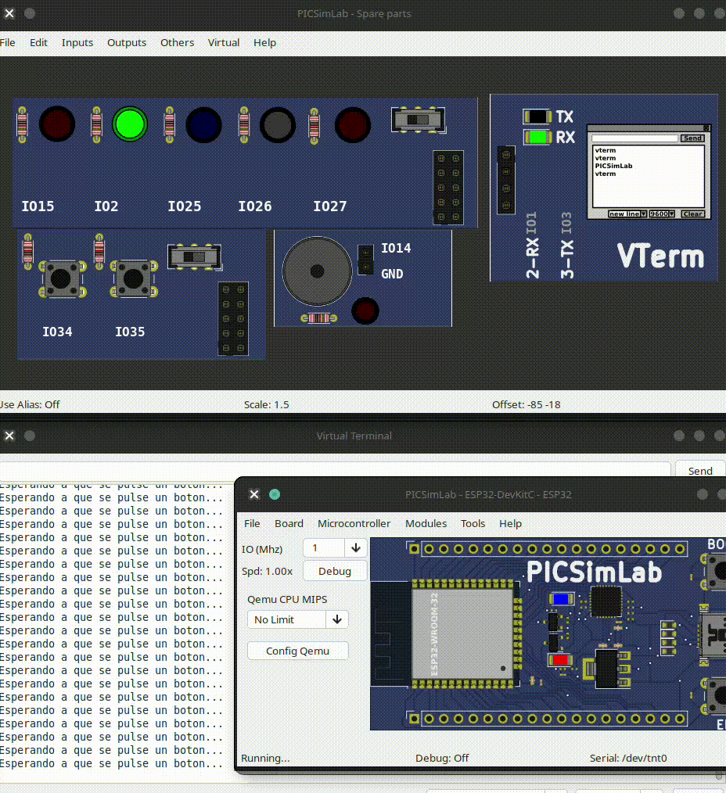

# Práctica Especial

Contruye el siguiente circuito



## Secuencia de luces

```c
#define LED_1 27
#define LED_2 26
#define LED_3 25
#define LED_4 33
#define LED_5 32
#define BUZZER 14

#define BTN_1 34
#define BTN_2 35

#define TIME 500

const int ledPins[] = {LED_1, LED_2, LED_3, LED_4, LED_5};
const int btnPins[] = {BTN_1, BTN_2};
const int numLeds = sizeof(ledPins) / sizeof(ledPins[0]);
const int numBtns = sizeof(btnPins) / sizeof(btnPins[0]);

void apagar_leds();

void apagar_leds(){
  for (int i = 0; i < numLeds; i++)
  {
    digitalWrite(ledPins[i], LOW); // Apagados al inicio
  }
}

void setup()
{
  Serial.begin(115200);
  Serial.println("Iniciando el programa...");

  // Configurar salidas
  for (int i = 0; i < numLeds; i++)
  {
    pinMode(ledPins[i], OUTPUT);
    digitalWrite(ledPins[i], LOW); // Apagados al inicio
  }
  pinMode(BUZZER, OUTPUT);
  digitalWrite(BUZZER, LOW);

  // Configurar entradas (Pines 34 y 35)
  for (int i = 0; i < numBtns; i++)
  {
    pinMode(btnPins[i], INPUT);
  }
}

void loop()
{
  apagar_leds();
  // Leer el estado de los botones
  bool btn1_state = digitalRead(BTN_1);
  bool btn2_state = digitalRead(BTN_2);

  if (btn1_state)
  {
    Serial.println("Boton 1 pulsado, parpadeando todos los LEDs...");
    apagar_leds();
    for (int i = 0; i < numLeds; i++)
    {
      digitalWrite(ledPins[i], HIGH);
      delay(TIME);
    }
    for (int i = 0; i < numLeds; i++)
    {
      digitalWrite(ledPins[i], LOW);
      delay(TIME);
    }
  }
  else if (btn2_state)
  {
    Serial.println("Botón 2 pulsado, encendiendo todos los LEDs...");
    apagar_leds();
    for (int i = 0; i < numLeds; i++)
    {
      digitalWrite(ledPins[i], HIGH);
    }
    delay(TIME);
    for (int i = 0; i < numLeds; i++)
    {
      digitalWrite(ledPins[i], LOW);
    }
    delay(TIME);
  }
  else
  {
    // Estado de espera estático (NO bloqueante)
    // Los LEDs se quedan fijos en un patrón alternado (encendido/apagado/encendido...)
    // hasta que presiones un botón.
    for (int i = 0; i < numLeds; i++)
    {
      Serial.println("Esperando a que se pulse un boton...");
      digitalWrite(ledPins[i], (i % 2 == 0) ? HIGH : LOW);
      delay(250);
    }
    apagar_leds();
     for (int i = 0; i < numLeds; i++)
    {
      Serial.println("Esperando a que se pulse un boton...");
      digitalWrite(ledPins[i], (i % 2 == 1) ? HIGH : LOW);
      delay(250);
    }
  }
}
```



Siguiente paso despues de cada cambio de estado, hacer sonar el buzzer. Es decir, agregar la siguiente linea donde sea necesario

## Secuencia con sonidos

```c
#define LED_1 27
#define LED_2 26
#define LED_3 25
#define LED_4 33
#define LED_5 32
#define BUZZER 14

#define BTN_1 34
#define BTN_2 35

#define TIME 500

const int ledPins[] = {LED_1, LED_2, LED_3, LED_4, LED_5};
const int btnPins[] = {BTN_1, BTN_2};
const int numLeds = sizeof(ledPins) / sizeof(ledPins[0]);
const int numBtns = sizeof(btnPins) / sizeof(btnPins[0]);

void apagar_leds();
void sonido(int time);

void apagar_leds()
{
  for (int i = 0; i < numLeds; i++)
  {
    digitalWrite(ledPins[i], LOW); // Apagados al inicio
  }
}

void sonido(int time, int count)
{
  for (int i = 0; i < count; i++)
  {
    digitalWrite(BUZZER, HIGH);
    delay(time);
    digitalWrite(BUZZER, LOW);
    delay(time);
  }
}

void setup()
{
  Serial.begin(115200);
  Serial.println("Iniciando el programa...");

  // Configurar salidas
  for (int i = 0; i < numLeds; i++)
  {
    pinMode(ledPins[i], OUTPUT);
    digitalWrite(ledPins[i], LOW); // Apagados al inicio
  }
  pinMode(BUZZER, OUTPUT);
  digitalWrite(BUZZER, LOW);

  // Configurar entradas (Pines 34 y 35)
  for (int i = 0; i < numBtns; i++)
  {
    pinMode(btnPins[i], INPUT);
  }
  sonido(200, 3); // Sonido de inicio para confirmar que el programa se ha cargado correctamente
}

void loop()
{
  apagar_leds();
  // Leer el estado de los botones
  bool btn1_state = digitalRead(BTN_1);
  bool btn2_state = digitalRead(BTN_2);

  if (btn1_state)
  {
    Serial.println("Boton 1 pulsado, parpadeando todos los LEDs...");
    sonido(150, 2); // Sonido para indicar que el botón 1 ha sido pulsado
    apagar_leds();
    for (int i = 0; i < numLeds; i++)
    {
      digitalWrite(ledPins[i], HIGH);
      delay(TIME);
    }
    for (int i = 0; i < numLeds; i++)
    {
      digitalWrite(ledPins[i], LOW);
      delay(TIME);
    }
  }
  else if (btn2_state)
  {
    Serial.println("Boton 2 pulsado, encendiendo todos los LEDs...");
    sonido(200, 3); // Sonido para indicar que el botón 2 ha sido pulsado
    apagar_leds();
    for (int i = 0; i < numLeds; i++)
    {
      digitalWrite(ledPins[i], HIGH);
    }
    delay(TIME);
    for (int i = 0; i < numLeds; i++)
    {
      digitalWrite(ledPins[i], LOW);
    }
    delay(TIME);
  }
  else
  {
    // Los LEDs se quedan fijos en un patrón alternado (encendido/apagado/encendido...) hasta que presiones un botón.
    sonido(100, 1); // Sonido suave para indicar que el programa está en modo de espera
    for (int i = 0; i < numLeds; i++)
    {
      Serial.println("Esperando a que se pulse un boton...");
      digitalWrite(ledPins[i], (i % 2 == 0) ? HIGH : LOW);
      delay(250);
    }
    apagar_leds();
    for (int i = 0; i < numLeds; i++)
    {
      Serial.println("Esperando a que se pulse un boton...");
      digitalWrite(ledPins[i], (i % 2 == 1) ? HIGH : LOW);
      delay(250);
    }
  }
}
```


## Sonidos

```c
#define LED_1 27
#define LED_2 26
#define LED_3 25
#define LED_4 33
#define LED_5 32
#define BUZZER 14

#define BTN_1 34
#define BTN_2 35

void led1();

void led1(){
  digitalWrite(LED_1, HIGH);
  delay(250);
  digitalWrite(LED_1, LOW);
  delay(250);
}

const int ledPins[] = {LED_1, LED_2, LED_3, LED_4, LED_5};
const int btnPins[] = {BTN_1, BTN_2};
const int numLeds = sizeof(ledPins) / sizeof(ledPins[0]);
const int numBtns = sizeof(btnPins) / sizeof(btnPins[0]);

// Configuración del canal PWM para el Buzzer en ESP32
const int buzzerChannel = 0;
const int resolution = 8;

void setup()
{
  Serial.begin(115200);
  Serial.println("Sistema de Luces y Sonido Iniciado...");

  // Configurar LEDs como salidas
  for (int i = 0; i < numLeds; i++)
  {
    pinMode(ledPins[i], OUTPUT);
    digitalWrite(ledPins[i], LOW);
  }

  // Configurar botones (Recuerda usar resistencias de pull-down externas en GPIO 34 y 35)
  for (int i = 0; i < numBtns; i++)
  {
    pinMode(btnPins[i], INPUT);
  }

  // Configurar el PWM para el buzzer en el ESP32
  ledcSetup(buzzerChannel, 2000, resolution);
  ledcAttachPin(BUZZER, buzzerChannel);
  ledcWriteTone(buzzerChannel, 0); // Silencio inicial
}

// Función para apagar todos los LEDs rápidamente
void apagarLeds() {
  for (int i = 0; i < numLeds; i++) {
    digitalWrite(ledPins[i], LOW);
  }
}

void loop()
{
  // Leer botones
  bool btn1 = digitalRead(BTN_1);
  bool btn2 = digitalRead(BTN_2);

  if (btn1 && btn2)
  {
    Serial.println("¡AMBOS BOTONES PULSADOS! Modo Caos activado...");

    // Efecto de sonido tipo glitch de computadora/caótico
    for (int i = 0; i < 10; i++) {
      int freqAleatoria = random(800, 3000); // Frecuencias altas aleatorias
      ledcWriteTone(buzzerChannel, freqAleatoria);

      // Encender un LED aleatorio y apagar los demás (Efecto estrobo)
      apagarLeds();
      digitalWrite(ledPins[random(0, numLeds)], HIGH);

      delay(60); // Ritmo muy rápido
    }

    ledcWriteTone(buzzerChannel, 0);
    apagarLeds();
  }else if (btn1)
  {
    Serial.println("Ejecutando: Efecto Sirena...");

    // Ciclo 1: Subiendo tono y encendiendo LEDs uno a uno
    for (int i = 0; i < numLeds; i++)
    {
      digitalWrite(ledPins[i], HIGH);
      ledcWriteTone(buzzerChannel, 600 + (i * 150)); // Tonos de 600Hz a 1200Hz
      delay(150);
      digitalWrite(ledPins[i], LOW);
    }

    // Ciclo 2: Bajando tono y regresando los LEDs
    for (int i = numLeds - 1; i >= 0; i--)
    {
      digitalWrite(ledPins[i], HIGH);
      ledcWriteTone(buzzerChannel, 1200 - ((numLeds - 1 - i) * 150));
      delay(150);
      digitalWrite(ledPins[i], LOW);
    }

    ledcWriteTone(buzzerChannel, 0); // Apagar sonido al terminar
  }
  else if (btn2)
  {
    Serial.println("Ejecutando: Efecto Arpegio Ascendente...");

    // Las frecuencias corresponden a las notas: Do, Mi, Sol, Do (Agudo), Mi (Agudo)
    int notas[] = {262, 330, 392, 523, 659};

    // Van encendiendo y se quedan encendidos acumulativamente
    for (int i = 0; i < numLeds; i++)
    {
      digitalWrite(ledPins[i], HIGH);
      ledcWriteTone(buzzerChannel, notas[i]);
      delay(200);
    }

    // Un destello final con el tono más agudo
    ledcWriteTone(buzzerChannel, 880); // Nota La (Aguda)
    delay(300);

    ledcWriteTone(buzzerChannel, 0); // Apagar sonido
    apagarLeds();                    // Apagar luces
    delay(200);
  }
  else
  {
    // Si no se presiona nada, nos aseguramos de que todo esté apagado y en silencio
    ledcWriteTone(buzzerChannel, 0);
    apagarLeds();
    led1(); // Pequeño destello para indicar que el sistema está activo
    delay(50); // Pequeña pausa para estabilidad
  }
}
```