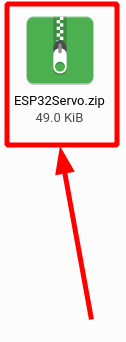
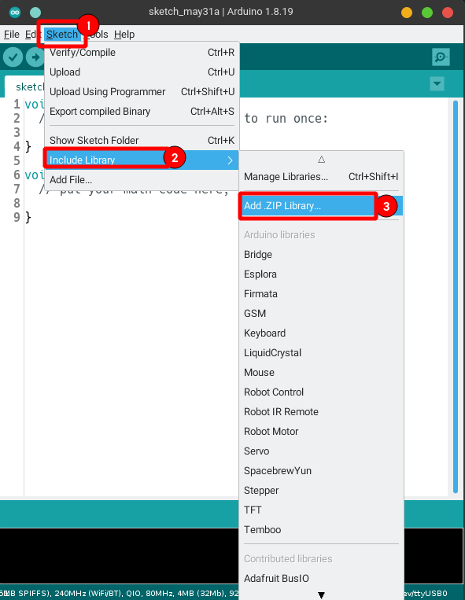
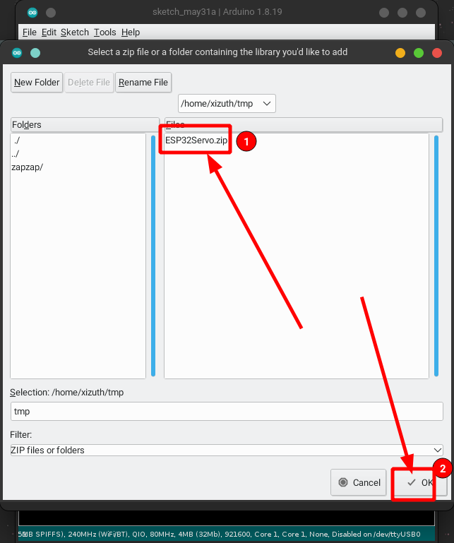
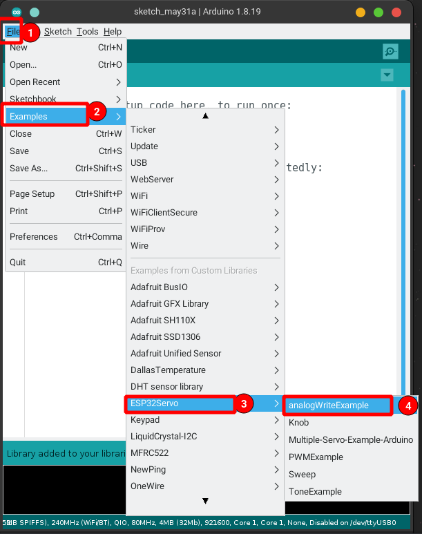
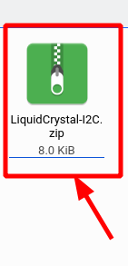
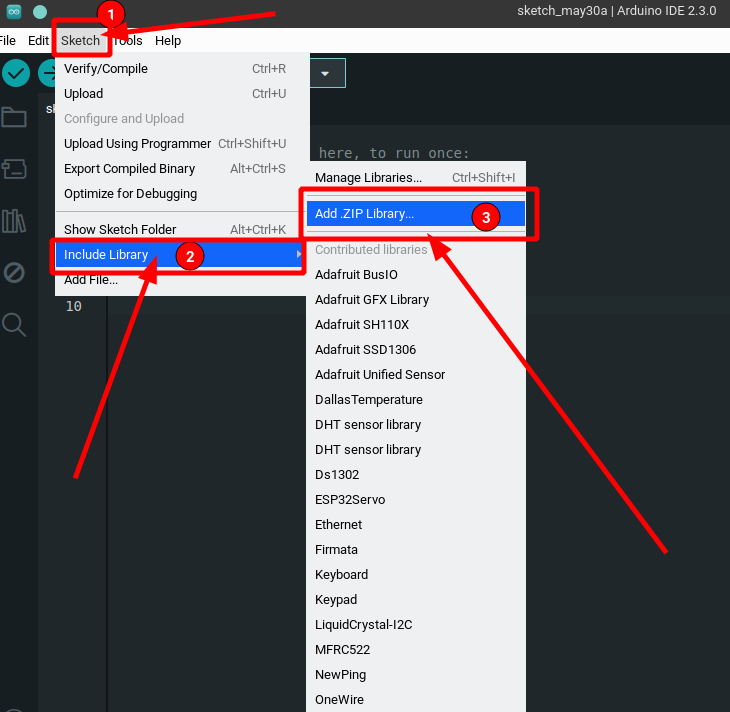
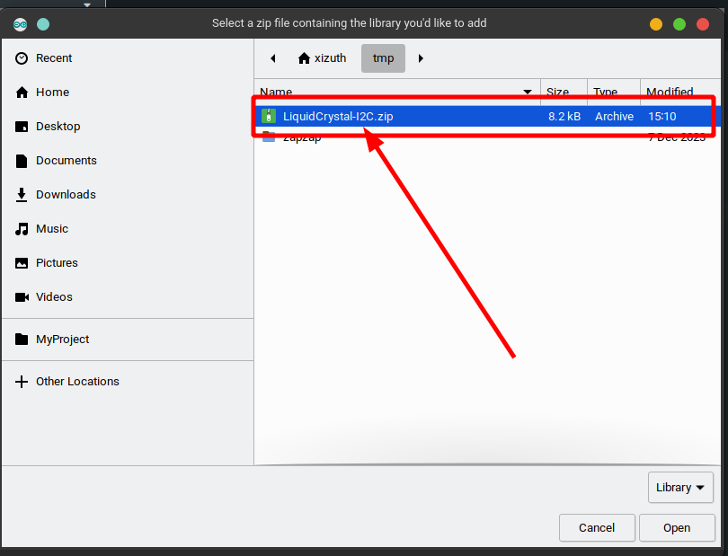
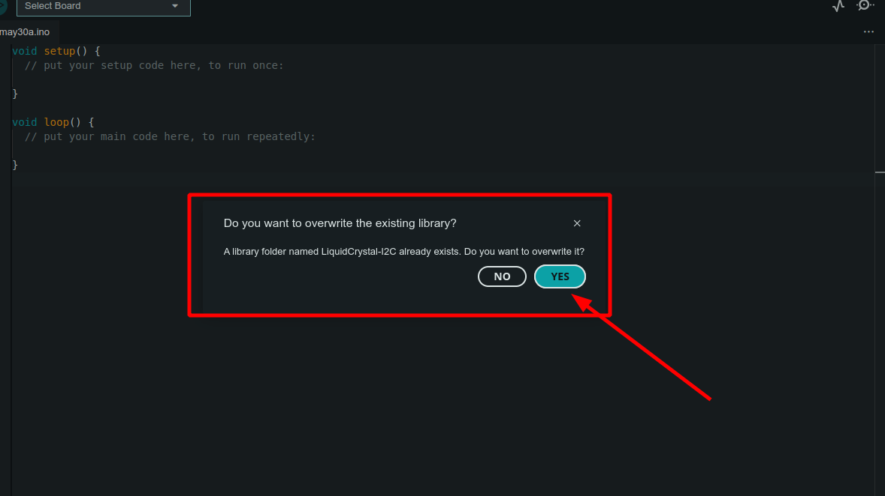
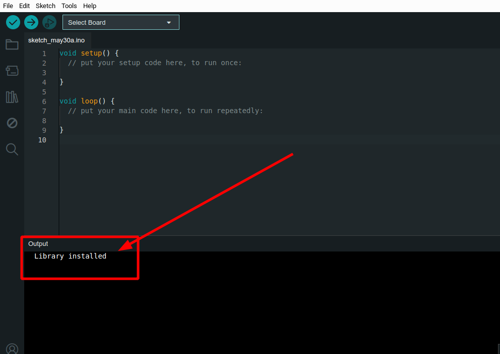
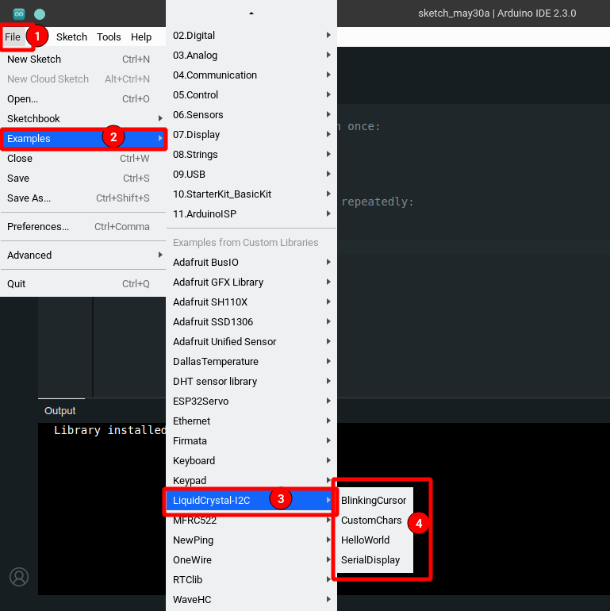

# Instalación manual de librerías

## Arduino IDE 1.8.x

1. Descargar la librería en cuestión a tu almacenamiento local  
    
2. Ir al menú *Sketch > Incluir librería > Agregar librería .ZIP*
    
3. Buscamos nuestra librería en formato `.zip`, damos `Ok`
    
4. Vemos el mensaje de que la instalación de la librería fue exitosa
    
5. Verificamos en los ejemplos y compilamos alguno para saber que todo este bien
    

## Arduino IDE 2.x

1. Descargar la librería en cuestión a tu almacenamiento local  
    

2. Abrir tu editor **Arduino IDE 2.x**
    Sketch > Agregar librería > agregar librería ZIP
    

3. Seleccionar el archivo en donde lo tengamos guardado
    

4. Aceptamos agregarla
    

5. Observamos el *log* con el mensaje de "Librería instalada"
    

6. Verificamos que se haya instalado correctamente con algún ejemplo, compilamos para ello
    