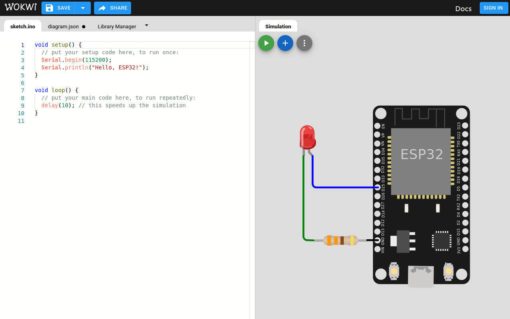

# Simuladores

Para la simulación del ESP32, tenemos algunas opciones, sin embargo, siempre de manera física sera mucho mejor.

## [Wokwi](https://wokwi.com/)

Es una simulador web para diversas plataformas, lenguajes, placas, microcontroladores.

## [PicSimLab](https://github.com/lcgamboa/picsimlab)

Este simulador se basa en puros proyectos open source, los puedes compilar para cada plataforma. 

Tiene una version Web (pero es super lenta y pesada, esperemos en un futuro mejore). [click aquí, picsimlab web](https://lcgamboa.github.io/)

