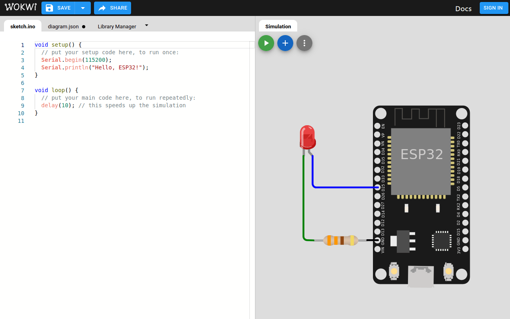
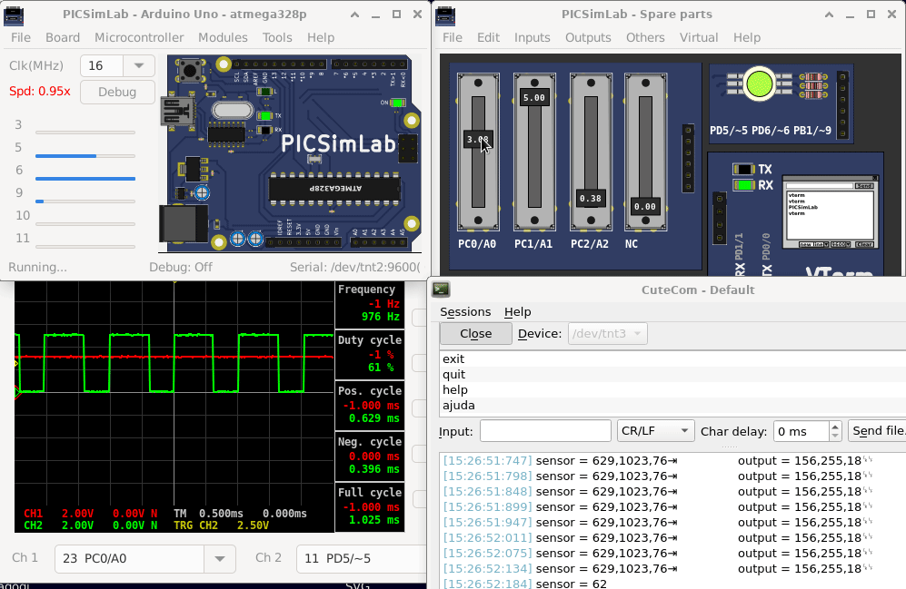
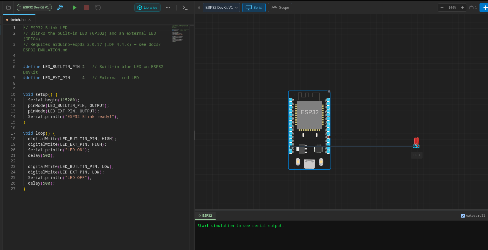

# Simuladores

Para la simulación del ESP32, tenemos algunas opciones, sin embargo, siempre de manera física sera mucho mejor.

## [Wokwi](https://wokwi.com/)

Es una **simulador web** para diversas plataformas, lenguajes, placas, microcontroladores.

## [PicSimLab](https://github.com/lcgamboa/picsimlab)

Este **simulador local**, se basa en puros proyectos open source, los puedes compilar para cada plataforma. 

Tiene una version Web (pero es super lenta y pesada, esperemos en un futuro mejore). [click aquí, picsimlab web](https://lcgamboa.github.io/)

## [Velxio](https://velxio.dev/)

Es un **simulador web** el cual tiene soporte para el microcontrolador ESP32. Entra al sitio dando [click aquí](https://velxio.dev/)

